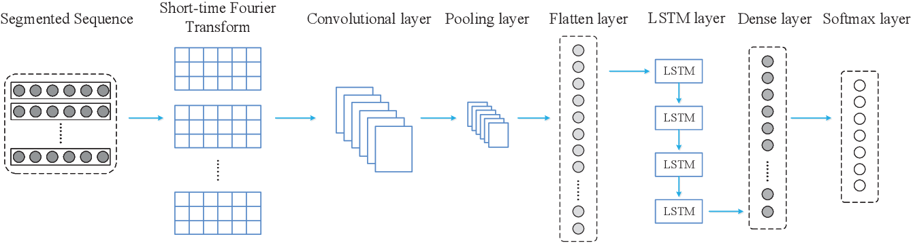
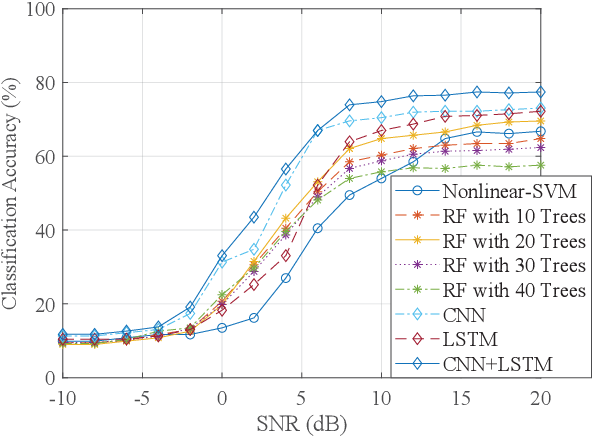

# **Signal Detection and Classification in Shared Spectrum: A Deep Learning Approach**

This readme file is an outcome of the [CENG501 (Spring 2021)](http://kovan.ceng.metu.edu.tr/~sinan/DL/) project for reproducing a paper without an implementation. See [CENG501 (Spring 2021) Project List](https://github.com/sinankalkan/CENG501-Spring2021) for a complete list of all paper reproduction projects.

# **1. Introduction**

In this project, signal classifier with the combination of Convolutional and Recurrent Neural Networks as described in the paper[1] is implemented. The paper is accepted for publishing in [IEEE INFOCOM 2021 Main Conference](https://infocom2021.ieee-infocom.org/accepted-paper-list-main-conference).

## **1.1. Paper summary**

Authors of the paper develop a deep neural network for classification of coexisting signal types such as IEEE802.11 (WiFi), LTE (Long Term Evolution) and 5G-NR (5G New Radio). Also, this network works on directly received signal's I/Q (In-Phase and Quadrature) samples meaning that receiver side does not have to decode the received signal in order to detect its type. The proposed architecture combines both CNN and RNN and uses segment of I/Q samples for training. It is trained in both simulation environment and experimental environment with the trasmitter and receiver hardware. Their results show that proposed architecture can achieve accurate classification in both environments.

WiFi, LTE and 5G signals can coexist in the shared spectrum (5-6 GHz) so assesment of the wireless environment is crucial in terms of better communication. In the paper, there are 7 classes for the classification task: WiFi, LTE, 5G, WiFi+LTE, WiFi+5G, LTE+5G, WiFi+LTE+5G

Authors compare their architecture with other machine and deep learning architectures such as SVM (Support Vector Machine), RF (Random Forests), CNN (Convolutional Neural Networks) and LSTM (Long Short-Term Memory) and the proposed architecture shows better performance in the classification task. The authors also try to improve the architecture's accuracy by introducing Frequency-Domain Analysis (FDA) into the input segment. They exhibit extensive analysis on the impact of FDA, RNN layer, and segment length. Also, they show their detailed analysis on SNR (Signal-to-Noise Ratio) and receiver antenna gains.

# **2. The method and my interpretation**

## **2.1. The original method**

### **2.1.1 Data Generation**

The wavefroms are generated with *MATLAB Communication Toolbox* and *5G Toolbox* with different set of signal features such as channel bandwidth, modulation and coding scheme, subcarrier spacing, allocated resource blocks etc. Signal features can be seen in the *Table I*. The generated waveforms are transmitted by three transmitter antennas and received by one receiver antenna. Each transmitter antenna is responsible for one signal type and the receiver system collects received signal's raw I/Q values. Then, 512 consequent I/Q pairs are saved together as a segment. There are approximately 100,000 segments are used in training and testing the classifier. The dataset is split into 80% for training and %20 for testing. Experimental setup of the authors can be seen in *Figure 10*. Also, they introduce additive white Gaussian noise (AWGN) channel model with different SNR values to the data in order to simulate the noise in the wireless environment.

<table style="margin-left:auto; margin-right:auto">
    <tr>
        <td><p align="center">
            
            <br>Table I from the paper: Parameter Options for Waveform Generator</br>
        </p></td>
        <td><p align="center">
            
            <br>Figure 10 from the paper: Experiment setup used for performance evaluation</br>
        </p></td>
    </tr>
</table>

### **2.1.2 CNN-LSTM Architecture**

Proposed architecture can be seen from the *Figure 2*. STFT (Short-Time Fourier Transform) is applied to the segmented sequence of 512 I/Q pairs with Kaiser-Bessel window function and this is fed into convolutional layer, and then pooling layer. Convoluted and pooled input is flattened and further fed into LSTM layer. Output of the LSTM layer is passed to dense layer and then softmax layer. Cross Entropy is used as loss function.

<table style="margin-left:auto; margin-right:auto">
    <tr>
        <td><p align="center">
            
            <br>Figure 2 from the paper: Overview of the proposed FDA-CNN-LSTM classifier</br>
        </p></td>
    </tr>
</table>

In the paper, there are no information about the depth of the network, number of the layers, layout of the layers, number of the layers, number of the hidden neurons in LSTM or Dense layers, training such as learning rate, optimizer, epochs, batch size, loss curves etc. Scaled Exponential Linear Unit (SELU) [2] is used as an activation function in order to avoid vanishing gradient problem. SELU can be seen in *Equation 7*, **α ≈ 1.6733** and **λ ≈ 1.0507**.

<table style="margin-left:auto; margin-right:auto">
    <tr>
        <td><p align="center">
            
            <br>Equation 7 from [2]: Scaled Exponential Linear Unit (SELU)</br>
        </p></td>
    </tr>
</table>

STFT with Kaiser-Bessel window function is applied to the input segmsents with 512 I/Q pairs; however, there are no information about the window length, shape factor (β) and side-lobe attenuation (α) values of Kaiser-Bessel window function. I/Q samples are in time-domain, and its frequency-domain information is obtained by applying STFT. In the paper, applying FDA to input shows increase in the model's performance.

One of the unmentioned information is about input size and this was one of the hardest part of this project. Generated I/Q data is a complex number; therefore, its real part (I) and imaginary part (Q) has to be split such that one segment is in the shape of `(512, 2)` or `(2, 512)`.

## **2.2. My interpretation **

### **2.2.1 Data Generation**

Authors are used hardware (three NI USRP-2921s and one NI USRP-2944R) for creating the dataset by transmitting and receiving WiFi, LTE and 5G waveforms. They combined two or three simultaneous transmissions to create coexisting signal types such as WiFi+LTE, WiFi+5G, LTE+5G and WiFi+LTE+5G. Since, I do not have any equipment for waveform transmission and reception, I planned to generate data directly within the *MATLAB* and generate pure signals (only WiFi, LTE and 5G signals without coexisting).

### **2.2.2 CNN-LSTM Architecture**

Since there are information about only activation function (SELU) and loss function (Cross Entropy), I had to improvise the network's design. In the paper, the proposed architecture is compared against CNN and LSTM models, so I planned to start implementing from CNN and LSTM models and then combining both CNN and LSTM layers.

As I mentioned, input shape was the puzzling part of this project since the I/Q value is a complex number. For example, a batch of segments with the shape of `(B, 512)` with complex numbers can be reshaped into to the following shapes before fed into to the CNN or LSTM layers:

* `(B, 1, 512, 2)`: Real (I) and imaginary (Q) values are in the width dimension. (*CNN*)
* `(B, 2, 512, 1)`: Real (I) and imaginary (Q) values are in the channel dimension. (*CNN*)
* `(B', L, 512, 2)`: *L* different segments are used in the channel dimension where *L* is the sequence length. Real (I) and imaginary (Q) values are in the width dimension. (*CNN*)
* `(B', L, 1024)`: *L* different segments are used where *L* is the sequence length. Real (I) and imaginary (Q) values are flattened to input dimension. (*LSTM*)
* `(B, 512, 2)`: Segment size is used as sequence length. Real (I) and imaginary (Q) value of an I/Q pair is flattened to input dimension. (*LSTM*)

But what about STFT of the segments? STFT of a batch of segments is in the shape of `(B, 512, 3)` with complex values. Therefore, it can be reshaped into to the following shapes before passed into the CNN or LSTM layers:

* `(B, 3, 512, 2)`: Real (I) and imaginary (Q) values are in the width dimension. (*CNN*)
* `(B, 2, 512, 3)`: Real (I) and imaginary (Q) values are in the channel dimension. (*CNN*)
* `(B', L, 512, 6)`: *L* different STFT of segments are used where *L* is the sequence length. Real (I) and imaginary (Q) values are flattened into the width dimension. (*CNN*)
* `(B', L, 3072)`: *L* different STFT of segments are used where *L* is the sequence length. Real (I) and imaginary (Q) values are flattened to input dimension. (*LSTM*)
* `(B, 512, 6)`: Segment size is used as sequence length. Real (I) and imaginary (Q) values STFT of a segment are flattened to input dimension. (*LSTM*)

In order to decide which shape is better in terms of classification performance, I planned to compare CNN, LSTM and CNN-LSTM architectures with different input shapes.

In order to decide whether FDA improves the classification accuracy, I planned to compare CNN, LSTM and CNN-LSTM architectures with and without FDA. I also planned to test that whether using FDA with the segment improves the classification performance as the authors mention that FDA is used together with the segment (512 I/Q pair). When STFT of a segment is used together with the segment data, the input batch shape is `(B, 512, 4)` where 1 dimension is for complex I/Q values and 3 dimension for complex STFT values. 

In this project, my goal was to do the followings in my implementations and compare their results in terms of classification accuracy:
* Train FCNN (Fully-Connected Neural Network), CNN, LSTM, CNN-LSTM model
* Use different input shapes
* Use segment, FDA and FDA with segment as an input
* Train with noisy data (dataset generated with different SNR values in AWGN channel model)

# **3. Experiments and results**

## **3.1. Experimental setup**

### **3.1.1 Dataset Generation**

I used *WLAN Toolbox*, *LTE Toolbox* and *5G Toolbox* in *MATLAB R2021a* release to generate waveforms with AWGN channel model. Waveforms are generated with every possible waveform combinations (which might be more extensive than the project's waveform parameters). For generating WiFi and LTE data, MATLAB script is written. I tried to write a similar script for generating 5G data, but *5G Toolbox* interface was not mature enough as *WLAN and LTE Toolboxes* because 5G is much newer technology compared to WiFi and LTE. Therefore, I generated the 5G data from the 5G Toolbox GUI and saved waveform variables into files. Then, 5G waveform variables was loaded from the files and written into dataset with a *MATLAB* script. It is said that, in the forums of *MathWorks*, *5G Toolbox* interface will be updated in *MATLAB R2021b* release so that script similar to *WiFi* and *LTE* waveform generator can be written for *5G* data generation.

For the project, approximately 45,000 segments (512 I/Q pairs) are generated: 14,410 WiFi, 13,972 LTE and 16,170 5G segments. The number of generated segments can be easily increased. Visualization of 256 I/Q pairs can be seen below.

<table style="margin-left:auto; margin-right:auto">
    <tr valign="top">
        <td><p align="center">
            
            <br>Generated WiFi Data in Time-Domain</br>
        </p></td>
        <td><p align="center">
            
            <br>Generated WiFi Data Constellation Scheme</br>
        </p></td>
        <td><p align="center">
            
            <br>Generated WiFi Data with FDA</br>
        </p></td>
    </tr>
    <tr valign="top">
        <td><p align="center">
            
            <br>Generated LTE Data in Time-Domain</br>
        </p></td>
        <td><p align="center">
            
            <br>Generated LTE Data Constellation Scheme</br>
        </p></td>
        <td><p align="center">
            
            <br>Generated LTE Data with FDA</br>
        </p></td>
    </tr>
    <tr valign="top">
        <td><p align="center">
            
            <br>Generated 5G Data in Time-Domain</br>
        </p></td>
        <td><p align="center">
            
            <br>Generated 5G Data Constellation Scheme</br>
        </p></td>
        <td><p align="center">
            
            <br>Generated 5G Data with FDA</br>
        </p></td>
    </tr>
    <tr valign="top">
        <td colspan="3"><p align="center">
            Figure: Generated Data's Visualizations
        </p></td>
    </tr>
</table>

Generated datasets with WiFi, LTE and 5G can be downloaded from my Google Drive:

* [Without Noise](https://drive.google.com/file/d/1sjkl9PG-CbqHMXUwUNx1jfrjSu0x9B2F/view?usp=sharing)
* [With 20 SNR](https://drive.google.com/file/d/1OoPl6WmLFQdH5JIrZbsDT3PK8eks5Ujm/view?usp=sharing)
* [With 15 SNR](https://drive.google.com/file/d/1dGlz121wXLq_G5vSnEVdilqpFW9zviJS/view?usp=sharing)
* [With 10 SNR](https://drive.google.com/file/d/167y0E7whWAq4WAWVUwF_0AkZ4EiTBNOw/view?usp=sharing)

Also, manually saved MATLAB variables can be downloaded [here](https://drive.google.com/file/d/1Ap5mfu7WCsynA9--izgBzu1S3A1oAoV_/view?usp=sharing).

### **3.1.2 Model Architecture**

Each model's parameters differs as input data shape varies. There are similarities in the namings of notebooks:

* ***FDA*** means that STFT of segment is used as input to the model.
* ***FDA+*** means that STFT of segment is used together with segment data as input to the model.
* ***S*** means that I and Q values are used in width dimension in CNN model instead of channel dimension and different. In LSTM model, I and Q values are used directly in input dimension.

For the training of all models, following parameters were used:

* **Optimizer**: Adam
* **Learning Rate**: 1e-4
* **Batch Size**: 128
* **Epochs**: 100
* **Loss Function**: CrossEntropy
* **Activation Function**: SELU

In the paper, the authors uses Softmax layer but I simply used output of last Dense layer in Cross Entropy loss function which is similar to using Softmax layer. The proposed architecture does not contain Batch Normalization layers in CNN but I used them before Max Pooling layers.

**Sequence length (*L*)** is selected as `4` CNN, LSTM and CNN-LSTM models.

Training hyperparameters and model designs are selected through tuning phase.

#### **3.1.2.1 Fully-Connected Neural Networks (FCNN)**

There are 3 different FCNN models: *`FCNN`*, *`FCNN-FDA`*, *`FCN-FDA+`* and they contain only two Dense layers.

#### **3.1.2.2 Convolutional Neural Networks (CNN)**

There are 8 different CNN models: *`CNN`*, *`CNN-1D`*, *`CNN-W`*, *`CNN-FDA`*, *`CNN-FDA+`*, *`CNN-S`*, *`CNN-S-FDA`*, *`CNN-S-FDA+`*. All of these models contain 9 Convolutional layers, 3 Batch Normalization layer, 3 Max Pooling layer and two (or three) Dense layers. Every 3 Convolutional layers are followed by one Batch Normalization and one Max Pooling layers. Output of the last Max Pooling layer is flatten for the Dense layer.

**S** in CNN model means that I and Q values are used in width dimension and different segments are combined as a sequence in channel dimension. For example, input shape of *`CNN-FDA`* is `(B, 2, 512, 3)` while input shape of *`CNN-S-FDA`* is `(B, L, 512, 2)` where *B* is the batch size and *L* is the sequence length. 

*`CNN-W`* is the specialized case of *`CNN-S`* with *L* value is equal to 1. 1D Convolutional, Batch Normalization and Max Pooling layers are used in *`CNN-1D`* such that input shape is `(B, 2, 512)` where *B* is the batch size.

#### **3.1.2.3 Long Short-Term Memory (LSTM)**

There are 6 different LSTM models: *`LSTM`*, *`LSTM-FDA`*, *`LSTM-FDA+`*, *`LSTM-S`*, *`LSTM-S-FDA`*, *`LSTM-S-FDA+`*. Every LSTM models contain one LSTM layer with 32 hidden neurons followed by Dense layer.

**S** in LSTM model means that I and Q values are flattened to be used in input dimension and 512 (I/Q pairs) is used in sequence length. For example, input shape of *`LSTM-FDA+`* is `(B, L, 4096)` while input shape of *`LSTM-S-FDA+`* is `(B, 512, 8)` where *B* is the batch size and *L* is the sequence length.

#### **3.1.2.3 Convolutional Neural Network with Long Short-Term Memory (CNN-LSTM)**

There are 6 different CNN-LSTM models: *`CNN-LSTM`*, *`CNN-LSTM-FDA`*, *`CNN-LSTM-FDA+`*, *`CNN-LSTM-S`*, *`CNN-LSTM-S-FDA`*, *`CNN-LSTM-S-FDA+`*. Same CNN and LSTM layers are used in CNN-LSTM model.

CNN part contains 9 Convolutional layers, 3 Batch Normalization layer, 3 Max Pooling layer where every 3 Convolutional layers are followed by one Batch Normalization and one Max Pooling layers. LSTM part contains one LSTM layer with 32 hidden neurons followed by Dense layer.

* Input shape for *`CNN-LSTM`* is `(B, 2, 512, 1)` and the input is converted into the shape of `(B, L, I)` by CNN layers where `L` is `4` and `I` is `128`. Then, it is passed to the LSTM layer and then to the Dense layer.

* Input shape for *`CNN-LSTM-S`* is `(B, L, 512, 2)` and the input is converted into the shape of `(B, L, I)` by CNN layers where `L` is `4` and `I` is `1024`. Then, it is passed to the LSTM layer and then to the Dense layer.

## **3.2. Running the code**

My project has the following file and folder structure:

```
project_Acir
│─── cnn/
│─── cnn-lstm/
│─── data_generation/
│    │─ lte_waveform_generator.m
│    │─ nr5g_generator.m
│    │─ nr5g_wave_generator.m
│    │─ wifi_waveform_generator.m
│─── fcnn/
│─── figures/
│─── lstm/
│─── snr/
│    │─── 10_dB/
│    │─── 15_dB/
│    │─── 20_dB/
│  README.md
│  Data_Visualization.ipynb
│  Results_(Bar_Graphs).ipynb
│  Results_(Line_Graphs).ipynb
```

* *cnn*, *cnn-lstm*, *fcnn*, *lstm*, *snr/10_dB/*, *snr/15_dB/* and *snr/20_dB/* folders contain notebook files of the models. Every notebook file is almost same with the minor changes such as input pre-processing, model definition parts etc.
* *data_generation* folder contains *MATLAB* scripts for waveform generation. However, *nr5g_generator.m* script does not directly generate waveform, it is used for reading *MATLAB* variables from files and writing the contents into files with the wanted form.
* *figures* folder contain figures used in this report.
* *Data_Visualization.ipynb* notebook is used for data visualization whose plots are used in this report.
* *Results_(Bar_Graphs).ipynb* and *Results_(Line_Graphs).ipynb* notebooks are used for plotting results of the models.

Most of the code files are notebooks; therefore, they can also be reached from this [link to my Google Drive](https://drive.google.com/drive/folders/16ZTRUde65ESYLY-3VP0eJ5AwXLKH6Zaa?usp=sharing) which also contains generated waveforms and saved *MATLAB* variables. I created and run the notebooks with *Google Colaboratory*. *MATLAB* scripts are written and run with *R2021a Update 4* release.

## **3.3. Results**

### **3.3.1 Classification Accuracies**

The results below shows that applying FDA on a segment and using it as input generally improves the models' classification performances. For some cases, using FDA together with the input segment also increases the classification accuracy.

### **3.3.1.1 Without Noise**

Trained models' classification accuracies can be seen in the figure below. All of these models are trained with generated WiFi, LTE and 5G data without any noise. Without noise, *`CNN-S-FDA`* achieves the highest classification accuracy with **`0.9730700179533214`**.

<table style="margin-left:auto; margin-right:auto">
    <tr>
        <td><p align="center">
            
            <br>Figure: Classification Accuracies without Noise by Architecture and Input Data</br>
        </p></td>
    </tr>
</table>

### **3.3.1.2 With SNR 20 dB**

Trained models' classification accuracies can be seen in the figure below. All of these models are trained with generated WiFi, LTE and 5G data over an AWGN channel with SNR 20 dB noise. With SNR 20 dB, *`CNN-S-FDA`* achieves the highest classification accuracy with **`0.9657598499061913`**.

<table style="margin-left:auto; margin-right:auto">
    <tr>
        <td><p align="center">
            
            <br>Figure: Classification Accuracies with SNR 20 dB by Architecture and Input Data</br>
        </p></td>
    </tr>
</table>

### **3.3.1.3 With SNR 15 dB**

Trained models' classification accuracies can be seen in the figure below. All of these models are trained with generated WiFi, LTE and 5G data over an AWGN channel with SNR 15 dB noise. With SNR 15 dB, *`CNN-LSTM-S-FDA`* achieves the highest classification accuracy with **`0.9676360225140713`**.

<table style="margin-left:auto; margin-right:auto">
    <tr>
        <td><p align="center">
            
            <br>Figure: Classification Accuracies with SNR 15 dB by Architecture and Input Data</br>
        </p></td>
    </tr>
</table>

### **3.3.1.4 With SNR 10 dB**

Trained models' classification accuracies can be seen in the figure below. All of these models are trained with generated WiFi, LTE and 5G data over an AWGN channel with SNR 10 dB noise. With SNR 10 dB, *`CNN-LSTM-S-FDA`* achieves the highest classification accuracy with **`0.9662288930581614`**.

<table style="margin-left:auto; margin-right:auto">
    <tr>
        <td><p align="center">
            
            <br>Figure: Classification Accuracies with SNR 10 dB by Architecture and Input Data</br>
        </p></td>
    </tr>
</table>

### **3.3.2 Classification Accuracies vs. SNR over an AWGN channel models**

Authors' classification performances with respect to SNR can be seen in *Figure 4*. Proposed architecture, combination of CNN and LSTM outperforms other techniques in almost every noise levels. My implementations' performances can be seen in figure below. Even though, I only trained and tested the models with SNR values 10, 15 and 20 dB, increase in the noise (i.e. decrease in the SNR value) affects the model's outcomes as expected. As noise is increased, the structure of the signal is distorted. When the noise is too much, the signal is distorted well-beyond the being meaningful. That's the reason the authors' accuracies are around the 10% as the the received signal is similar to the noise itself.

<table style="margin-left:auto; margin-right:auto">
    <tr>
        <td><p align="center">
            
            <br>Figure 4 from the paper: Classification performance comparison under AWGN</br>
        </p></td>
    </tr>
    <tr>
        <td><p align="center">
            
            <br>Figure: Comparison of classification accuracies under AWGN</br>
        </p></td>
    </tr>
    <tr>
        <td><p align="center">
            <br>Figure: Confusion matrices of the most accurate CNN, LSTM and CNN-LSTM models with SNR 20 dB from my implementation.</br>
        </p></td>
    </tr>
</table>

My model is trying to decide whether is input data belongs to WiFi, LTE or 5G signal type. However, in the paper, their model is trying to classify a signal into one of the 7 different signal class. I believe accuracy differences between the paper and my implementations might be originated from the fact that my models' classification task is much more simpler since there are no coexisting signals.

### **3.3.2 Confusion Matrices of the Best Models**

Confusion matrices of authors' CNN, LSTM and CNN-LSTM models can be seen in *Figure 8*. 
Even though, it is not clearly stated that models from which noise level are used in the confusion matrices in the paper, my results are from noise level of SNR 20 dB. Confusion matrices from my implementations can be seen in figures below. Selected models are *`CNN-S-FDA`*, *`LSTM`* and *`CNN-LSTM-S`* as they have the highest accuracies among their counterpart architectures in that noise level.

<table style="margin-left:auto; margin-right:auto">
    <tr>
        <td colspan="3"><p align="center">
            
            <br>Figure 8 from the paper: Confusion matrices for superimposed signals with FDA</br>
        </p></td>
    </tr>
    <tr>
        <td><p align="center">
            
            <br>(a) CNN-S-FDA</br>
        </p></td>
        <td><p align="center">
            
            <br>(b) LSTM</br>
        </p></td>
        <td><p align="center">
            
            <br>(c) CNN-LSTM-S</br>
        </p></td>
    </tr>
</table>

For the most of the models, trained deep neural networks distinguish WiFi data from the others very well but it struggles with differentiating the LTE and 5G data. In some cases, the model cannot even learn the distinguishing LTE and 5G data. This is the case for the models with accuracies around 60%, 70% and even 80%. This can partially seen from my LSTM model's example above. 

# **4. Conclusion**

In this project, the paper *Signal Detection and Classification in Shared Spectrum: A Deep Learning Approach* [1] is implemented and outcomes from the paper is tried to be reproduced. In order to implement signal classifer, WiFi, LTE and 5G waveform data is generated with AWGN channel models and generated data is used for training and testing the models. Signal classifiers with different architectures are implemented and studied in details. *Convolutional Neural Network*, *Long Short-Term Memory* and *combinations of both of these networks *are used as deep neural network architecture. Trained signal classifiers are compared in terms of classification accuracies within the different AWGN channel models.

Authors state that introducing Frequency-Domain Analysis by applying Short-Time Fourier Transform with Kaiser-Bessel window function to input I/Q data increases the model's accuracy and this can be also seen from the result of my implementations. It is also stated that using I/Q segments together with Frequency-Domain Analysis improves the model's accuracy and this can be also seen in my implementation results.

# **5. References**

[1]: [Zhang, W., Feng, M., Krunz, M., & Abyaneh, A. (2020). Signal Detection and Classification in Shared Spectrum: A Deep Learning Approach. *IEEE INFOCOM 2021*.](http://wireless.ece.arizona.edu/sites/default/files/Infocom_2021_wenhan.pdf)

[2]: [Klambauer, G., Unterthiner, T., Mayr, A. & Hochreiter, S. (2017). Self-Normalizing Neural Networks.](https://arxiv.org/abs/1706.02515)

# **Contact**

Berker Acır - berker.acir@metu.edu.tr, berkeracir159@gmail.com
