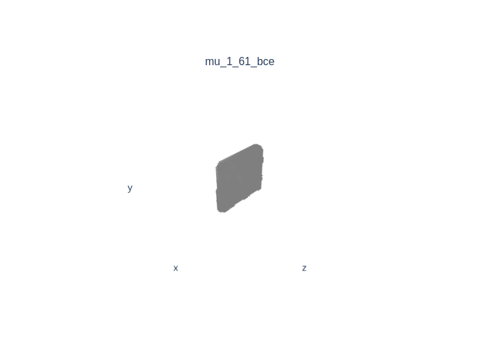

# Learning Part Generation and Assembly for Structure-aware Shape Synthesis

This readme file is an outcome of the [CENG501 (Spring 2021)](http://kovan.ceng.metu.edu.tr/~sinan/DL/) project for reproducing a paper without an implementation. See [CENG501 (Spring 2021) Project List](https://github.com/sinankalkan/CENG501-Spring2021) for a complete list of all paper reproduction projects.

# 1. Introduction

VAE-GANs are used to generate 3D shape synthesis which attracts attention recently. However, it is hard to satisfy topological correctness. 
Besides, generated shape does not hold reasonable geometry.  

In order to overcome these lacks, Jun Li, Chengjie Niu, Kai Xu proposed "Learning Part Generation and Assembly for Structure-aware Shape Synthesis" in 2020. It was published at "Conference on Artificial Intelligence, AAAI".  

We aim to process the dataset by data augmentation and voxelization, implement model architectures, loss functions and training methods.
In our training and testing, we only used chair models. 

Our main aim is to obtain visaully acceptable chair parts and successfully assemble them. 

## 1.1. Paper summary

Authors propose to use a VAE-GAN for each part of an object. Doing so, there will be N generator networks such that each one is responsible for creation of a part. Created parts may be resulted in a disjoint shape that needs small transformations to correctly assemble. 
Thus, a network, called Assembler, learns to transformations in terms of translation and scaling. By using a generator network for each part, more detailed models can be obtained in contrast to methods using a single generative network (Wu et al. 2016) to create the model. 

# 2. The method and our interpretation

## 2.1. The original method

The VAE-GAN model is named as Part Generator. VAE-GANs combine the idea of Variational Autoencoder and Generative Adversarial Networks by using the decoder of VAE as generator of GAN.
Consequently, a VAE-GAN has three main modules: Encoder, Decoder/Generator and Discriminator. We will explain the model in details below.

### Encoder

Input : 64 x 64 x 64 voxel grid  
Output: mu = mean computed from the input  
&nbsp;&nbsp;&nbsp;&nbsp;&nbsp;&ensp;&ensp;&ensp;&ensp;
log_sigma = log of standart deviation computed from the input  

Encoder learns to map the input shape to the normal distrubition with zero mean and std is one.
The model consist of five consecutive volumetric (i.e. 3d convolution) convolutions. Channel sizes are (64, 128, 256, 512, 100) respectively.
Kernel sizes are (4 x 4 x 4) and same among the convolution layers. Stride is 2 for all layers except the last layer which uses stride of 1. 
Batch normalization and ReLU layers are inserted between two convolutional layers.  
  After the convolutional layers, two Multi Layer Perceptrons (MLP) are used to sample from mean and std. 
MLPs map from 100 dimensional vector to the latent vector which has 50 dimensions. At the end, reparametrization trick is applied as usual for VAEs.

### Decoder/Generator

Input : 50 dimensional latent vector  
Output : (64 x 64 x 64) generated fake volume  

Decoder/Generator learns to generate fake volumes from the latent vector.  
It reverses the encoder model with a minor change at the last layer. It uses Sigmoid as the activation function of the last layer. 
In details, the decoder has five consecutive volumetric transposed convolutions. Kernel sizes are (4 x 4 x 4), channel sizes are (1, 512, 256, 128, 64) 
and strides are 2 except the first layer that has stride of 1.  

### Discriminator

Input : (64 x 64 x 64) input volume that can be fake or real  
Output : [0, 1] validation for the input whether it is fake (0) or real (1).  

Discriminator tries to indicate whether an input volume is real or fake. It takes a batch from the dataset and another batch to the generated fake volumes. 
Then, it tries to maximize output (1) for real volumes while minimizing the validation for fake volumes (0).  
The model of the discriminator is same as the Encoder. It has a MLP after convolutional layers that gives validation score.
To make predictions between 0 and 1, the MLP employs the Sigmoid activation.

### Assembler

Input : (sub_parts x 64 x 64 x 64) input volumes that are randomly transformed.  
Ouput : translational_regression = (sub_parts x 3).  
&nbsp;&nbsp;&nbsp;&nbsp;&nbsp;&ensp;&ensp;&ensp;&ensp;
scaling_regrassion = (sub_parts x 1)
  
Assembler takes volumes that are randomly transformed and learns to regress inverse of these transformations. Its architecture is the same as the encoder. After the last layer of convolutional layers, two seperate MLPs are added. One learns to regress translation  and other learns to regress scaling.

### Dataset  

[Dataset Link](https://cs.stanford.edu/~ericyi/project_page/part_annotation)  

The PartNet (a subset of ShapeNet) has chosen for input volumes. It contains various classes with points for each model, model's subpart labels and segmentation images.
For instance, a chair object consists of 4 subparts. Each object is given as two files one contains point coordinates and the one contains labels of the points. 
We prepared voxel data from points for the object and its subparts.

### Training Details  

Training is not end-to-end. There are three training phases: pretraining of VAEs, training of VAE-GANs and Assembler Training.  
Remember that there are N many VAE-GANs where N is the number of subparts of an object.  
As authors stated that Wasserstein GANs usually have large gradients, which might result in unstable training. Therefore, we trained VAEs as the first step. 
Then, we trained the VAE-GAN with pretrained VAE. Optimizer is chosen as ADAM with batch size is 32 betas are (0.5, 0.999) and learning rate is 0.001.

#### Loss

Partgen_loss = Reconstruction_loss + alpha1 x KL_loss + alpha2 x Adverserial_loss + Reflection_loss  

**Reconstruction loss** affects the VAE module. It measures the mean squared error between real and fake volumes: MSE(real_volume, fake_volume). 
It provides reproduce encoded volume.  
**KL loss** affects the encoder and forces encoding being fitted into a normal distrubition with 0 mean 1 std.  
**Adverserial loss** affects whole components of the Part Generator. It is the same loss function that is used in Wasserstein GANs.  
**Reflection loss** affects the VAE module. Since most of the parts have symmetry, generated shapes should preserve symmetry.  
**Adverserial Loss** Authors followed WGAN-GP (Gulrajani et al. 2017). It includes adverserial loss of WGAN and gradient penalty which stabilizes the GAN.


## 2.2. Our interpretation 

#### Normalization
The paper indicates: "Batch normalization and ReLU layers are inserted between convolutional layers.", for discriminator network. However, it is not recommended to use batch normalization
in the discriminator since it can learn correlation. The desired behaviour of discriminator is deciding each sample individually. Therefore, we implemented layer normalization between convolutional layers of discriminator as proposed at "Improved Training of Wasserstein GANs" (Gulrajani et al., 2017).  

#### Dataset
ShapeNet part dataset contains only points and labels as mentioned above. To voxalize point data, we used binvox which is an open source voxelization framework. Binvox is voxelizer of the ShapeNet as the offical ShapeNet states.
However, we recognized a problem with binvox. Selecting points according to the labels and creating voxels via binvox is erroneous.
To clarify, when we voxelize each part's point cloud, voxel of the part occupies all 64 voxels at least for a dimension. This breaks the authors interpretation. Which is, if no translation and scaling is applied to parts, they should be assembled without any retransformation.
They seperated the parts and creates dataset without any translation and scaling. In other words, a leg of the chair occupies exactly the same voxels with the leg in the original complete chair. However, we could not manage this by using the provided dataset and binvox.
Therefore, we implemented our own voxelizer. Doing so, we were able to scale and translate data. 

Preserving part translations and scalings same as the complete model, resulted in 64x64x64 voxels being mostly empty (on average 1700 voxels are occupied). And authors used deformation technique (Zheng et al. 2011) to enhance the dataset. Unfortunately, we could not find or implement this method. Therefore we used a smaller dataset with sparse voxel data.
 
#### KL Loss Constant
KL Loss is multiplied with 2 at the paper. However, in our tests, the model did not learn to produce any subpart. It produces empty or fully occupied volumes. We set it to 2*10^-4. Even with this small coefficient, model generates average volumes, i.e. resembling volumes that dominates the dataset. Therefore, we trained the VAE with MSE loss for 20 epochs then accounted KL loss with coefficient 2*10^-4 for 10 epochs. This approach similar to the method propesed by Bowman et al. 2016 (Subsection 3.1) and it is only applied for pretraining of the VAEs.

#### n_critic 
GAN training is not specified in the paper. We implemented the approach proposed at WGAN-GP. "n_critic" is equal to 5 since we recognized a consensus while investigating GANs.

#### Loss for Assembler Network
It is not specified in the paper. We selected Log Cosh loss between estimated transformations and real transformations.

#### Binary Cross Entropy Loss
Most of the VAE implementations uses binary cross entropy for their reconstruction loss. After getting poor results in some cases (where voxel data of a specific part is too sparse), we tried binary cross entropy instead of mean squared error and obtained better results. 

#### DCGAN implementation
Authors of the paper followed WGAN-gp (Gulrajani et al. 2017), but even if changing the hyper parameters we could not obtained meaningful results. Even if the decoder generated successful parts after pretrainig, it deterioted with WGAN-gp training. One thing we noticed is that, discriminator cannot separate real and fake voxels even in the begining of the training. Therefore we implemented DCGAN (Radford et al. 2016) aproach for VAEGAN training. By scaling the generator error by 5e-3, we obtained successful results.

#### Symmetry losss
Authors applied symmetry loss depending on [the study](http://vecg.cs.ucl.ac.uk/Projects/SmartGeometry/approx_symmetry/approx_symm_sig_06.html) of Mitra, Guibas, and Pauly. It was implemented in 2006 and there was no code provided for symmetry plane detection for 3D shapes. We searched and found neural models, however, we could not employ or implemet them owing to time limit and performance considerations. In fact, there is a study [Nerd](https://github.com/zhou13/nerd) but it uses three neural networks for symmetry plane estimation. Thus, we thought this massively extends the time required to create dataset. 


# 3. Experiments and results

## 3.1. Experimental setup
 
Part Generation: Original paper compares generated parts' symmetry. They expect high reflectance of reflective parts. Since we could not aplly symmetry loss, we omitted this test.

Assembler: They randomly transform the original shapes and gives assembler. Assembler regresses tranformation and the regressed transformation is applied on the disrupted shapes. Authors compare IoU (intersection over union) of original volume and reshaped volume.

## 3.2. Running the code

```
project
│   README.md
│   dataset.py
│   networks.py
│   parser.py
│   pretrain_vae.py
│   symmetry.py
│   test_assembler.py
│   test_vae.py
│   train_assembler.py
│   train_vaegan.py
│   utils.py
│
│─── assembly_results 
│
│─── generation_results
│
│─── wgan_gp_results
│
│─── plots
```

[datasets.py](./dataset.py) contains Dataset structures for VAE-GAN and Assembler. There are two dataset class: PartNetDataset (for VAE-GAN) and AssemblerDataset (for Assembler).  
[networks.py](./networks.py) contains network models namely, Encoder, Decoder, VAE, Discriminator and Assembler.  
[parser.py](./parser.py) contains code for voxelizing the dataset using binvox, open3d.  
[pretrain_vae.py](./pretrain_vae.py) contains code for training VAEs before the VAE-GAN training. Saves the model at each n epochs. It trains VAEs for each part.    
[symmetry.py](./symmetry.py) contains code for finding model symmetry vector, taken from https://github.com/mikedh/trimesh/issues/947. Unfortunately, did not work well for our case.  
[test_assembler.py](./test_assembler.py) contains code for testing assembler with deformed parts from validation set. Prints mse loss of regressed part scaling and tranlation. Also prints IoU of assembled and target model.  
[test_vae.py](./test_vae.py) contains code for testing the VAE with validation set. Saves the generated and target models images. (Saves two generated image one for vae trained with mse and the other trained with bce)  
[train_assembler.py](./train_assembler.py) trains the Assembler. Saves the model at each n epochs.  
[train_vaegan.py](./train_vaegan.py) trains VAE-GANs before the VAE-GAN training. Saves the model at each n epochs.  
[utils.py](./utils.py) contains code visualizing and saving voxels, voxels to pointcloud and pointcloud to voxels transformations, tranlating and scaling voxel data. Used for processing dataset with our own voxelization method.
[generation_results](./generation_results) contains png files for generated parts using the generative networks with bce and mse reconstruction losses and target parts.  
[assembly_results](./assembly_results) contains png files for predicted assembly and correct assembly of models.  
[wgan_gp_results](./wgan_gp_results) contains png files for generated parts (failed training) using Wasserstein Gan with gradient penalty.
Each code can be run with "python3 python_file_name.py".  
[plots](./plots) contains png files for lossxiteration plots for VAE, Discriminator and Assembler network trainings.
   


## 3.3. Results

Due to implementation differences and omitted implementation details in the paper, we cannot compare our results with the results in the paper directly.  

For assembly quality:
- Using the back part of the chair as the anchor:
  - Obtained 2.534 mean square error of predicted translations and scalings compared to target ones.
  - Obtained 0.20 IoU between transformed parts and correct assembled parts.
- Using the seat part of the chair as the anchor: 
  - Obtained 3.991 mse 
  - 0.1 IoU
    
### Part assembly results: 
Predicted                  |  Correct
:-------------------------:|:-------------------------:
  |  
  |  
  |  
  |  
  |  


### Part generation results: 
MSE Reconstruction Loss    |  BCE Reconstruction Loss  |  Target
:-------------------------:|:-------------------------:|:-------------------------:
    |     |    
   |    |  
  |   |  
  |   |  
  |   |  

# 4. Conclusion

The paper proposes an interesting method, which uses compliceted and strong architectures.
Unfortunately, the paper omits important information, which at first glance does not sound important.
If there were any explanation on how they voxelized data, implemented deformation technique, implemented symmetry detection, training details of assembler network, we could obtain better results.
Nonetheless, we tried different approached and methods for training the models and achieved visually acceptable results.

# 5. References

[Improved Training of Wasserstein GANs](https://arxiv.org/abs/1704.00028)  
[3D-VAE-GAN](https://arxiv.org/pdf/1610.07584.pdf)  
[DCGAN](https://arxiv.org/pdf/1511.06434.pdf)  
[KL cost annealing (Section 3.1)](https://arxiv.org/pdf/1511.06349.pdf)  

# Contact

ozgraslan17@gmail.com  
burakbolatcs@gmail.com
