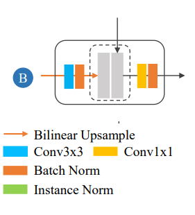
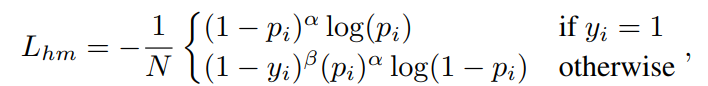

# Object-Guided Instance Segmentation for Biological Images[1]

This readme file is an outcome of the [CENG501 (Spring 2021)](http://kovan.ceng.metu.edu.tr/~sinan/DL/) project for reproducing a paper without an implementation. See [CENG501 (Spring 2021) Project List](https://github.com/sinankalkan/CENG501-Spring2021) for a complete list of all paper reproduction projects.

# 1. Introduction

The paper we tried to implement is titled Object-Guided Instance Segmentation for Biological Images and published in Proceedings of the AAAI Conference on Artificial Intelligence 34. The authors suggest a box-based instance segmentation method for biological images. 

## 1.1. Paper summary
Box-based instance segmentation methods use Region of Interest (RoI) patches generated from bounding boxes. These bounding boxes are obtained by examining all the pixels in an image. After obtaining the bounding boxes RoI patches are generated. The Keypoint Graph method[2] uses a separate segmentation branch to operate on cropped RoI patches. In the segmentation branch five keypoints are detected for generating a bounding box, which creates problems when objects are overlapping. In this paper authors suggest using a keypoint based method where only the center point is used to generate each bounding box for overcoming the problem of overlapping keypoints at the detection branch. 

# 2. The method and my interpretation
Proposed method is given below:
<p align="center">
	
</p>

## 2.1. The original method

There are two branches on network architecture. One is to detect object and create the bounding boxes, other is to segmentation.

### 2.1.1 Detection Branch

In first branch a U shaped architecture used with skip layers (See [4] ). Skip layers made the layer size double at each combine operation. U shaped network and Skip layer schema is given below:
<p align="center">
	
	
</p>

The output of the U shaped network is used for three operation: Heatmap generation, Bounding Box Width Height, and Bounding Box Offset generation. 
<p align="center">
	
</p>
2.1.1.1 Heatmap:

Each object has only one ground truth center location. The authors suggest using a Gaussian circle around each center point following the work of [5] and using the variant focal loss.

<p align="center">
	
</p>

Where _i_ indexes _i_ th location in the predicted heatmap _N_ is the total number of center points, _y_ is the ground truth. We use α = 2, β = 4 in this paper.The predicted center heatmaps are refined through a non-maximum-suppression (NMS) operation. The operation employs a 3×3 max-pooling layer on the center heatmaps. The center points are gathered according to their local maximum probability.

2.1.1.2 Offset Map: 

The center points are predicted from downsized heatmaps. When mapping these points from downsized images to their original locations an offset map is needed. The authors used L1 loss for regressing the offset center points.

2.1.1.3 Width-Height Map: 

Width and height of bounding boxes are obtained from heatmaps. The authors used L1 loss to regress width and height of bounding boxes.

### 2.1.2 Segmentation Branch
After cropping RoI patches from encoder and object layers using the bounding boxes, a deep to shallow segmentation branch is developed through a skip combination module as can be seen in Figure 1. For removing the neighbor statistics from RoI patches the authors use instance normalization. For the optimization of segmentation branch, binary cross entropy loss is used. Different sampling method is used. Instead of batch norm instance norm is used:

<p align="center">
	
</p>


## 2.2. My interpretation 

Explain the parts that were not clearly explained in the original paper and how you interpreted them.

* We did not know if there is a filter before Heatmap, Width-Height, and Offset Heads. In [newer paper](https://arxiv.org/abs/2106.07159)[3] there is filters before each head. But in the code the heads are different. In the code Width-Height and Offset modules filters are swapped so there are 7x7 layers before WH  and 3x3-1x1 layers before offset head. 
<p align="center">
	
</p>

* Non-linearities are never mentioned in paper. However, in code after every convolutional layer there is a ReLU non-linearity Layer.

# 3. Experiments and results

## 3.1. Experimental setup

We used google colab for training and tests.

https://colab.research.google.com/drive/1p497oiw_nq-5X9c0t9eLL0GVyYhuUZUo?usp=sharing

Their setup given below:
"The training images are augmented using random cropping and random horizontal/vertical flipping. We set 100 epochs for training. We stop the network when the validation loss does not significantly decrease. The input resolution of training and testing images is 512×512. The weights of the backbone network are pre-trained on ImageNet dataset. Other weights of the network are initialized from a standard Gaussian distribution. We use Adam with an initial learning rate of 1.25e-4 to optimize the model weights. We implement the model with PyTorch on NVIDIA M40 GPUs."

We used exactly same parameters with 10 epochs. However, since google colab did not let us to use it anymore (GPU limit reached), we only have the 5 epoch results for kaggle DSB52018 dataset.

## 3.2. Running the code
The part below directly taken form [the real repository.](https://github.com/yijingru/ObjGuided-Instance-Segmentation)

1. Create `YourDatasetClass`, for example, `dataset_neural.py` in `datasets`.
2. Import `YourDatasetClass` in `module.py`, for example `from datasets.dataset_neural import Neural`.
3. Create a `YourDatasetName` and make correspondence between the `YourDatasetName` and `YourDatasetClass` in `module.py`,  for example `self.dataset = {YourDatasetName:YourDatasetClass, 'neural': Neural}`
4. Use the `YourDatasetName` you created in the following commands.

### 3.2.1. Train the model
```ruby
python main.py --phase train --num_epoch 100 --data_dir YourDataPath --dataset YourDatasetName --ngpus 0 --batch_size 8 --num_workers 4 
```

### 3.2.2. Test the model
```ruby
python main.py --phase test --data_dir YourDataPath --dataset YourDatasetName
```


### 3.2.3. Evaluate the model
```ruby
python main.py --phase eval --data_dir YourDataPath --dataset YourDatasetName --eval_type seg --seg_thresh 0.5
```
## 3.3. Results

Output of the eval function:
```
ap@0.5 is 0.7817917000451478, iou is 0.8159621532246749
ap@0.55 is 0.7420598926153958, iou is 0.8267407055455888
ap@0.6 is 0.7027410652673193, iou is 0.8366706783924476
ap@0.65 is 0.6526887459787108, iou is 0.8473813933669887
ap@0.7 is 0.5855413254640123, iou is 0.8610690677047939
ap@0.75 is 0.49836565846319414, iou is 0.875981400107438
ap@0.8 is 0.38387169408242716, iou is 0.8939700495156038
ap@0.85 is 0.23473154767889984, iou is 0.9154754407514619
ap@0.9 is 0.0948747988760061, iou is 0.9402873869874471
ap@0.95 is 0.010814004286980127, iou is 0.9726941869071761
```

#### Table1. Comparison of Results    
 
Results| AP 0.5| AP 0.75 | IOU 0.5 | IOU 0.75 | FPS | 
-------|-------|---------|---------|----------|-----|
Paper | 84.85 | 65.14| 87.17| 91.47| 3.27|
Ours | 78.17| 49.83| 81.59| 87.59 | 2.76|


# 4. Conclusion

Discuss the paper in relation to the results in the paper and your results.

# 5. References

[1] [Jingru Yi, Hui Tang, Pengxiang Wu, Bo Liu, Daniel J. Hoeppner, Dimitris N. Metaxas, Lianyi Han, Wei Fan. Object-Guided Instance Segmentation for Biological Images, 2019.](https://arxiv.org/abs/1911.09199) 

[2] [Jingru Yi, Pengxiang Wu, Qiaoying Huang, Hui Qu, Bo Liu, Daniel J. Hoeppner, Dimitris N. Metaxas. Multi-scale Cell Instance Segmentation with Keypoint Graph based Bounding Boxes, 2019.](https://arxiv.org/abs/1907.09140) 

[3] [Jingru Yi, Pengxiang Wu, Hui Tang, Bo Liu, Qiaoying Huang, Hui Qu, Lianyi Han, Wei Fan, Daniel J. Hoeppner, Dimitris N. Metaxas.Object-Guided Instance Segmentation With Auxiliary Feature Refinement for Biological Images. 2021](https://arxiv.org/abs/2106.07159)

[4] [Olaf Ronneberger, Philipp Fischer, Thomas Brox.U-Net: Convolutional Networks for Biomedical Image Segmentation. 2015](https://arxiv.org/abs/1505.04597)

[5] [Hei Law, Jia Deng.CornerNet: Detecting Objects as Paired Keypoints.2018](https://arxiv.org/abs/1808.01244)

# Disclaimer

We did not write the code ourselves. The code belongs to [Jingru Yi](https://github.com/yijingru/ObjGuided-Instance-Segmentation). Code of our selected paper[1] is not shared. [An improved version of the paper](https://arxiv.org/abs/2106.07159)[3] was published in IEEE Transactions on Medical Imaging. We used that paper's[3] code and deleted the newly added parts of the paper[3].

# Contact

Yusuf Can Aydemir : can.aydemir@metu.edu.tr

Yunus Bilge Kurt : yunusbilgekurt@gmail.com
