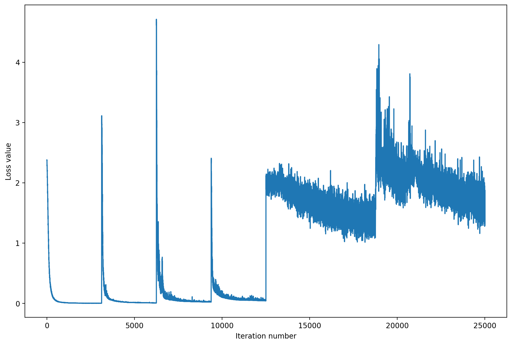

# Go Wide, Then Narrow: Efficient Training of Deep Thin Networks

This readme file is an outcome of the [CENG501 (Spring 2021)](http://kovan.ceng.metu.edu.tr/~sinan/DL/) project for reproducing a paper without an implementation. See [CENG501 (Spring 2021) Project List](https://github.com/sinankalkan/CENG501-Spring2021) for a complete list of all paper reproduction projects.

# 1. Introduction

The paper (available [here](https://arxiv.org/abs/2007.00811)) is published in ICML 2020. The authors proposes a method to train thin networks that are to be utilized in devices with limited resources. For this, the method uses a wider teacher model to train thin networks by layerwise imitation. The paper also includes theoratical analysis of the method's benefits over regular training.

## 1.1. Paper summary

While the network size is increased to improve accuracy of predictions, there is also a need for compact networks that are to be used in systems like mobile devices which are relatevely poor in compuational resources. Thin networks are utilized in these types of settings to decrease the computational complexity of predictors. But, training thin networks is a challange considering their loss surface tends to be irregular and nonconvex. On the other hand, the wider networks with more parameters are tend to have a smoother loss surface, hence easier to train.

The paper proposes a layerwise imitation method, where each layer of thin network is initialized via imitating the wider network that is trained in a regular setting beforehand. Since the loss surface is nonconvex in thinner networks, a good initialization of the parameters with this method improves the training performance of the thin network. The network is further finetuned after this step. The layerwise imitation part is the novel part of the method. 

It is theoretically proven in the paper that with this method depth of the thin network do cause a linear discrepancy from wide network while in regular training the discrepancy between wide an thin networks are double exponential. For theoretical analysis, mean field analysis is used.

For the layerwise imitation, the building blocks of the networks should be matched at the output which may be achived via different structures in different kind of networks. In general, linear transformations are applied after the target layer to match the size and then another transformation is applied to cast it back to the input size of next layer. The comparision is done between the values between linear transformations and the wide network with a loss function like Mean Squared Error or Kullback-Leibler Divergence. After the imitation, the existent linear transformations are merged into the network layers.

Paper utilizes the idea of Wide Residual Networks idea in Image Classification part of experiments.

# 2. The method and my interpretation

Considering the time consuming training operations, I only targetted to reproduce a subset of experiments in the paper. I worked on the Image Classification part. I had to make some assumptions either due to limited resources or implicitness on some parts of the method.

## 2.1. The original method

Image Classification part of the experiments utilizes ResNet architectures that uses Bottleneck layers. The 4 blocks/layers of ResNet architecture trained in a layerwise imitation approach where each of these blocks/layers actually involve multiple building blocks (convolutions, batch normalization etc.). The method used in the paper counted them as a single entity for imitation. Considering the Bottleneck blocks are used and Wider Residual Networks do not change in channel size between blocks in these type of ResNet architectures, there is no need to apply linear transformations between blocks for layerwise imitation

The training consisted of 4 stages:

- The Wider ResNet, which is also called teacher model in the paper, is trained with SGD Optimizer with momentum `0.9`, batch normalization decay `0.9` (which is the default in PyTorch), weight decay `1e-4` and batch size of `256`. The learning rate is linearly increased from `0` to `0.1` in first 5 epochs and than it is decreased by `10x` at epoches 30, 60, 80. This wider network has the channel size of `4x` at the `3x3` sized filters.
- After the wider network is trained, layerwise training is applied to blocks of the thin, or student, network for 10 epochs, using Mean Squared Error Loss and SGD with momentum `0.9`. No weight decay is applied. The Cosine Learning Rate Decay is applied from `0.1` to `0`.
- After, for 50 epochs, training is done on final output where Kullback-Leibler Divergence is applied. Again Cosine Learning Rate Decay is applied from `0.1` to `0`.
- Lastly, there is a vague mention of finetuning on training dataset 30 epochs.

## 2.2. My interpretation 

- While it is not mentioned in the paper, I thought `1x1` sized convolutions should be used to change the channel size between layers of regular Convolutional Networks as in Bottleneck Layers using in ResNet models to change the channel size. Considering the properties of convolutions, these `1x1` convolutions may be merged layer into the network after layerwise imitation is done. Still, it is not needed for ResNet implementations with Bottleneck layers.
- Given the 90 epoch size in the method described for training the thin network and earlier mention of the finetuning on the paper, I thought there must be 30 steps of finetuning with the similar standard approach applied in training Wider ResNet.
- For Kullback-Leibier Divergence to be applied the truth values should be either log base 2 probabilities or regular probabilities while the output should be log base 2 probabilities. For this reason, I applied `log_softmax` to them.

# 3. Experiments and results

## 3.1. Experimental setup

- While the original paper uses ImageNet, it is a huge dataset, so I tried to reproduce the results with CIFAR-10 to reduce training time. Since it is a smaller dataset, I thought I could use smaller epoch sizes.
- For the baseline and wide models, I thought I could use pretrained models to save on time. While I could not be able to find `4x` wide ResNet50 models, I used `2x` wide models as teacher model. The paper also mentions they might be used.
- Unfortunately, a lot of time lost with the mistakes in the process, so for last training I had to decrease the epoch count dramatically for each stage.

## 3.2. Running the code

I created a Jupyter Notebook that is runnable on Google Colab or Kaggle or local given required libraries and tools are initialized on the system. It setups the datasets, nonstandard packages beforehand. It may utilize CUDA.

## 3.3. Results

For the results I obtain, due to the decreased training time and usage of pretrained networks, there is no possibilty of direct comparison with the results on the paper. Below are the Top-1 accuracies of ResNet50 layers where pretrained ResNet50 is used as teacher and ResNet50 with `1\2` width is used for student.
The `student-1` received 1 epoch per layer for first stage, 3 epochs for the second stage and 2 epochs for finetuning on the training data.
The `student-2` received 2 epochs per layer for first stage, 4 epochs for second stage and 4 epochs for finetuning on the training data. 
The pretrained model is trained for 100 epochs with SGD similar to vanilla training described on the paper on CIFAR-10 data.

| Network      | Accuracy | Type      |
|--------------|----------|-----------|
| ResNet50     | 92%      | Teacher   |
| ResNet50-1/2 | 35%      | Student 1 |
| ResNet50-1/2 | 41%      | Student 2 |

From the loss values in the first stage of training, I thought as the stage progressed to later layers, epoch count could be increased to obtain efficient results.

The loss plot of the described method for `student-2` is below. It indicates layerwise initialization is working very efficiently. The training loss values, accuracy values and loss plot is also inspected from the notebook itself. Notebooks with outputs are added for both students.

# 4. Conclusion

Despite conclusive results cannot be obtained due to:

- ImageNet dataset being not used due to huge size.
- Resnet50-1/2 not being a pretrained model, results for it could not be obtained in vanilla training settings due to high epoch size of 100 needed.
- Not being able to apply the suggested 90 epoch size on the student model to see if near accuracy to teacher model is obtained due to limited computational resources.

This is partly due to first trying the implementation with the original PyTorch ResNet and resizing the images to `256x256`. After to decrease training time, a implementation of ResNet for `CIFAR-10` is found but not being able to notice early enough that the resize transformation should be changed, unnecessary time has been lost.

Still, from both teoretical analysis of the paper indicating the discrepency decreases with this method and accuracies obtained with a low epoch count indicates the method might be promising for thin network training. And the code generated might be used to generate the results with the original hyperparameters despite some more optimizations might be made on the code.

# 5. References

- Zhou, D., Ye, M., Chen, C., Meng, T., Tan, M., Song, X., Le, Q.V., Liu, Q., & Schuurmans, D. (2020). Go Wide, Then Narrow: Efficient Training of Deep Thin Networks. ICML.
- Zagoruyko, S., & Komodakis, N. (2016). Wide Residual Networks. ArXiv, abs/1605.07146.
- Ara'ujo, D., Oliveira, R., & Yukimura, D. (2019). A mean-field limit for certain deep neural networks. arXiv: Statistics Theory.
- Huy Phan. (2021). huyvnphan/PyTorch_CIFAR10 (v3.0.1). Zenodo. https://doi.org/10.5281/zenodo.4431043

# Contact

Özgür Bağcı (bagciozgur@yahoo.com)
