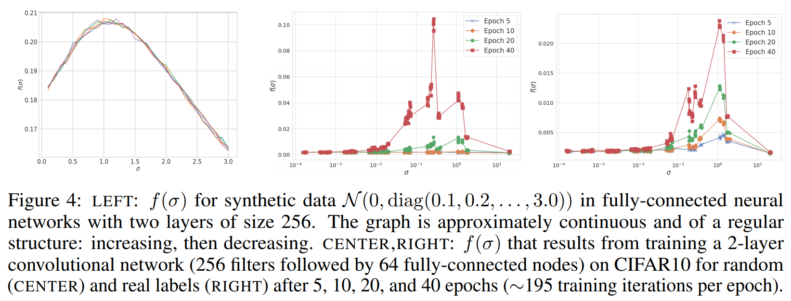
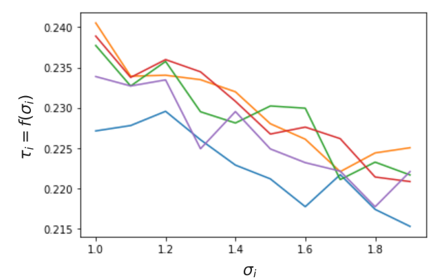

# What Do Neural Networks Learn When Trained With Random Labels?

This readme file is an outcome of the [CENG501 (Spring 2021)](http://kovan.ceng.metu.edu.tr/~sinan/DL/) project for reproducing a paper without an implementation. See [CENG501 (Spring 2021) Project List](https://github.com/sinankalkan/CENG501-Spring2021) for a complete list of all paper reproduction projects.

# 1. Introduction

The paper1 is published at NeurIPS 2020 and its objective is to extend the information about what DNNs (deep neural networks) learn for a given dataset. It examines the outcomes of having networks learn random labels and explains these from a statistical point of view.

## 1.1. Paper summary

The paper first introduces the fact that over-parameterizing DNNs helps them generalize better and makes them be able to learn even a fully random labeled dataset. Thus, there are lots of works that aim to explain differences of training with random and real labels in terms of training time, loss surface, and etc. Also, the authors state that despite these works, what DNNs learn in a random label setting is not thoroughly understood and they give better insights on this topic.

It is showed that training on random labels can have both positive and negative effects which mean faster or slower convergence depending on the training setup and model architecture. Transferring process consists of training on random labels on a subset of the training set (called upstream task) and using the obtained weights on a disjoint subset of the training set with either real or random labels (called downstream task).

It is discussed in the paper that how positive transfer is associated with intrinsic features of the input dataset and when the positive or negative transfer can happen. It is explained that there is a mapping between learned weights of the first layers of the network and dataset and how this mapping can be utilized to understand typical behaviors of DNNs such as which layers solve certain parts of the problem.

### 1.2 Main Contributions

The main contributions of the paper can be summarized as follows:

 - The paper makes experiments for both positive and negative transfer cases for random label training while in previous works, the main focus was the negative effects.
 - The paper interprets what DNNs learn in random label training.
 - In previous works positive transfer coming from bigger weights (because the cross-entropy loss is scale-sensitive) was not taken into account. The paper emphasizes this and makes a rescaling before starting the transfer.
 - Alignment phenomenon explains the well-known fact that how earlier layers in DNNs generalize while later layers specialize.
 - The paper proves that what the first layers of a network learn can be approximated by eigenvectors of the input data.
 - Specialization at upper layers may prevent the positive transfer and can be mitigated by increasing model with at those layers.

# 2. The method and my interpretation

## 2.1. The original method

### 2.1.1 Positive transfer

What the paper offers is that the training phase captures the statistical characteristics of a given dataset and it is the reason for positive transfer. To demonstrate this, image patches from the dataset are extracted and the covariance matrix of this data is used to find eigenvectors. A measurement called "misalignment" calculating the deviation between the covariance matrix of data and the covariance matrix of weights learned in the first layers is given in the paper. By using misalignment, authors show that a low misalignment is observed after training both real and random labels whereas there is a high misalignment between weights and some random orthonormal basis. To prove that this result is related to positive effect, Gaussian approximation of weights after random label training is used and positive transfer similar to when random label training weights are directly used occurs. Said misalignment calculation is done by applying the following formula (From Appendix A-6 of paper):

The result is the alignment score

Another result derived from the alignment situation is that there is a mapping between eigenvalues of the covariance matrix of image patches and eigenvalues of weights at the first layer. In other words, the first layer learns this mapping function and it is proven in the paper that with different setups and hyperparameters this function's shape is roughly similar. The authors discuss that understanding this function might lead to being able to learn weights by only using input data statistics. This mapping is explained in the paper with the following equation

### 2.1.2. Transferring more

Performance of learning transfer can be improved by transferring more layers. In the previous section, only the first layer weights are considered. By treating previous layers' filter weights as the data, more weights can be transferred from the upstream task. Better training accuracy is achieved with this initialization method regardless of the model or dataset used.

### 2.1.3 Negative transfer

Negative transfer in some experiments occurs when the neuron activation values are suddenly and extremely dropped at the point where the training switches to the downstream task. These reductions are observed more in later layers because that earlier layers generalize while the later layers specialize in DNNs. Positive transfer cases, however, are not affected by this problem as much. It is depicted that increasing the number of neurons in the last layers can make the network remain enough capacity for the downstream task and subsequently solve the negative transfer problem.

## 2.2. Our interpretation 

In the original paper, multiple numbers of different network architectures are tried with different datasets, pre-training methods, training hyperparameters, and initialization weights for different results. While on these examples, some of these parameters are specified, some others are usually left out. On these occasions, meaningful parameters from earlier experiments (if they have similar architecture, parameters, etc.) are used.

Other than that, the paper uses a value called "init_scale" for scaling initialization weights while attempting He initialization. However, it is not clear what this scaling factor is used for. Thus, it is analyzed if these values are related to the standard deviation used in He normal initialization. However, these experiments yielded no meaningful result. Hence, this scaling factor is not used in our training.

# 3. Experiments and results

## 3.1. Experimental setup

1. **Figure1**: The effects of pre-training are demonstrated. For this reason, VGG16 models are pre-trained on CIFAR10 examples with random labels and subsequently fine-tuned on the fresh CIFAR10 examples with either real labels or random labels using different hyperparameters. As is also explained in the paper, the VGG16 model is slightly modified for these experiments. The average pooling layer and last two fully connected layers are removed.

2. **Figure2**: The "misalignment" between the data and first layer weights is observed. For this reason, a two-layer convolutional network (256 convolutional filters, 64 fully connected nodes) is trained on the CIFAR10 dataset with real/random labels.

3. **Figure3**: It is desired to show that, the covariance matrix of the first layer weights aligns with the data covariance matrix. For this reason, a WideResNet (WRN-28-4) is trained on the CIFAR10 examples with random labels. While some WideResNet architectures are readily available and popular, (WRN-28-4) is not and there is a requirement to have some modifications. For this reason, a publicly available WideResNet code[2] is repurposed to give desired results. It is required to visually show that, there exist some eigenvectors belonging to filters' covariance matrix aligned with the eigenvectors of the data. For better visualization, the WideResNet model is slightly modified to have 5x5 filters instead of 3x3 filters on the first layer. It should be noted that this modification has a significant impact on network training time.

4. **Figure4**: It is defined that for aligned matrices (data and first layer weights in this case) there exists a transfer function to obtain eigenvalues of first layer weights using data covariance matrix (eigenvectors and eigenvalues). The relation between the data eigenvalues and first layer weight eigenvalues is desired to be observed. This relation is explained in section 2.1.1 and this equation is used to plot the figures in this part.

For this reason, two networks are used: A two-layer fully connected network, and a two-layer convolutional network. Both of these networks are trained with random labels and real labels and the relation between eigenvalues is observed. It should be noted that some parameters of these two networks are not fully defined. Hence, it is considered these two networks are similar to the networks given in previous experiments. The fully connected networks used in this part has the following structures for their respective figures (figure 4b).

Table-4a - Fully connected network architecture for obtaining figure 4a left and figure 4b.

These fully connected networks are trained with a batch size of 128, learning rate of 0.01 and epoch of 200.

The networks used to obtain figure 4a-middle and figure 4a-right is a two-layer convolutional network with 256 convolutional filters followed by 64 fully-connected nodes, which connects to the classifier head of 10 classes. 

5. **Figure5**: It is desired to show the difference of accuracy on downstream tasks when different kinds of upstream training are performed:
    - A network is pre-trained on random labels, obtained weights are used in the downstream task. Weights are not scaled as it is done in Figure1 setup.
    - A network is pre-trained on random labels, obtained weights are used in the downstream task. Weights are scaled to match their initial <em>l2</em> norms.
    - A network is pre-trained on random labels, Gaussian approximation of obtained weights is used in the downstream task.
    - Downstream task is trained from scratch.
## 3.2. Running the code

In the paper, each experiment and idea is also supported with a figure. In the project, the focus is reimplementing the theory behind the paper and reproducing these ideas/experiments. For this reason, each figure is divided into its own code section and presented in Jupyter Notebook format. A user can run these notebooks individually to obtain their corresponding figures. Hence, the codes are complete by themselves to reproduce the figures presented in the paper.

## 3.3. Results

### 3.3.1 Positive & negative transfer by training with random labels

Figure-1a - Original Figure1 in the paper

  
   
  
  

Figure-1b - Reproduction of Figure1. The upper left image corresponds the first part of the original image the upper right image corresponds the second part of the original image and etc.

It can be seen from the Figure-1a and Figure-1b that results for downstream task with real labels are reproduced similar to the paper. For these task there is a clear separation indicating positive and negative transfer. However, for downstream task with random labels, the results are not as expected. We believe that this situation stems from the lack of experimental setup of downstream tasks with random labels. As it's discussed in section 2.2, crucial information such as number of random classes to be used is missing. Also, value of init_scale parameter which we could not fit into our experiments changes between random and real labeled trainings. This might lead to the differences between the results presented here.
 
### 3.3.2 Misalignment between data and first layers.

Figure-2a - Original Figure2 in the paper

  
   

Figure-2b - Reproduction of Figure2. Left: Training with settings given in the paper. Right: Training with settings that is modified to be able to learn random labels

Two experiments are conducted to reproduce Figure2. First one uses setup from the original paper which uses all training set, 0.01 learning rate, and 40 epochs. However, this training could not learn when random labels are used. We believe this is acceptable because the model used in this section is a very simple model that contains only one convolutional layer. Even though it is sufficiently complex for learning real labels, it fails for random labels because learning random labels is mostly done with overparameterization. This is required considering there is nothing to learn and model should memorize the random labels. The model used here cannot perform this deliberate overfitting. Thus, another setup enabling the model to output less loss is used. It uses less data (5000 instead of 50000), 0.001 learning rate, and 80 epochs. Consequently, curves more similar to original ones are obtained. Misalignment of eigenvectors of weights are smaller and more seperable than the misalignments of random basis. Behaviour of increasing misalignment as the training continues is also reproduces in this setup. 
 
### 3.3.3 Visualization of covariance matrices of first layer and data

Figure-3a - Original Figure3 in the paper

  
   
  

Figure-3b - Reproduction of Figure3. Left: Random filters of first conv. layer of WideResNet-28-4 Middle: Ten eigenvectors of weights of first conv. layer of WideResNet-28-4 with largest eigenvalues. Right: Ten eigenvectors of image patches data with largest eigenvalues

As it can be seen from the figures, filters from the random label training are looking noisy similar to the paper. Likewise, filters from image patches look more or less similar. Similarity for filters of image patches can be improved if more image samples are used. However, because of hardware limitations more samples could not be fit into the memory.

On the other hand, eigenvectors of weights are quite dissimilar which stems from the fact that authors train the model 70 times to better approximate the distribution of weights and ours is result of just one training due to the time limits. 

### 3.3.4 Relation between eigenvalues of first layer and data

Relation between eigenvalues of the first layer and training data is represented as in the next figure:

Figure-4a - Original Figure4 in the paper

Before talking about the results on the middle and right figures from figure 4a, information on left figure should be explained. In the left figure, artificial data is generated by an artificial covariance matrix and a network is trained as explained in section 3.1 . To better explain the left figure, paper presents Appendix E-1 where three different figures are generated from the training of artificial data and different networks architectures (All are fully connected networks). The results obtained from these figures is as follows in Appendix E-1.

Figure-4b - Original Figure20 (from Appendix E1) in the paper

In order to check the correctness of eigenvalue relations, these simpler networks and their eigenvalue relations are checked first. Upon creating the artificial data and creating networks, the networks are trained and first layer weights (and their covariance matrices) are used to obtain the following figures. Each figure represents 5 runs
with different random initializations.

  
   
  

Figure-4c - 

Upon inspection of these figures, it can be seen that the claim of the paper holds true. Trained
networks are obtained in which the first layer weights only differ by the same orthogonal transformation Furthermore, both the decreasing part or the increasing part may be missing depending on the architecture or training settings/hyperparameters, but same shape of curves in all experiments are observed.

Since similar results are obtained for the fully connected network, a slightly advanced network (convolutional network as explained in section 3.1) can be inspected and similar eigenvalue relations are obtained. These relations can be seen on the next figure:

  
   

Figure-4d - 

It can be noted that these figures are more noisy with respect to the figures of the paper in figure 4a. This is becouse in the paper, 50 trainings are averaged while obtaining this figure, only 1 training is done due to trainining time restrictions. However, these figures are sufficient to show the claims of the paper and the generated figures possess the same important characteristics every time its generated. Both curves have somewhat of an increasing and decreasing structure. More importantly, larger eigenvalues of data covariance matrix lead to larger effective learning rate in gradient descent, which leads in turn to larger corresponding values of first layer weights.

### 3.3.4 Accuracy on downstream tasks with different kinds of upstream training

Difference of accuracy on downstream tasks when different kinds of upstream training are performed is given as the next figure in the paper for real labels.

Figure-5a - Original Figure5 in the paper

The figure given in the paper compares a curve “covariance” to the performance of others as explained in section 3.1. For covariance curve the filters in the convolutional layer are random samples from a Gaussian distribution with mean 0 and the covariance obtained from training on random labels. It can be seen that on the figure from the paper that the "covariance" curve performs as good as the "pretrained" curve. The result of experiments conducted to replicate this is given in the next figure 

Figure-5b - Experiment results

In the results obtained for real labels, it can be observed it is not similar to the results of the paper. In the experiment results it can be seen that a pretrained network performs better while the "covariance" network performs close to a network trained from scratch (But with weight scaling). We think that the reason of the discrepancy between "no scale" and the  "from scratch" is due to the difference of "init_scale" used in the paper not being used in this experiment. Other than that, the experiment does not agree with the papers claim that "covariance" network gives close performance to a pretrained network. However, we think that this disagreement is due to possible errors made in the execution of our code.

# 4. Conclusion

One of the claims of this paper is that, pre-training (upstream training) can have positive or negative effects for later trainings (downstream training), regardless of architecture or whether labels are random or not. The experiments for figure 1 yielded supporting results. Some positive effects explained in the paper found as negative and vice versa. However, this does not necessarily contradict with the idea since the architectures in the experiments could not be the exact same of the paper due to missing parameters and in the experiment results it is just that different relations are obtained.

To prove that positive effects of pre-training comes from the alignment of first layer weights and data, misalignment calculcation is implemented and misalignment scores between eigenvectors obtained from the data and first layer weights throughout the training are depicted on a figure. In addition to that, to make a better comparison, misalignment scores between weights and randomly created orthonormal basis are given. Results for the latter being distinctly more than the former acknowledges that alignment idea of authors are indeed true.

Experiments of figure 3 yielded similar image patches to the ones from the paper. On the other hand, eigenvectors of weights are somewhat dissimilar. The reason for this discrepancy is assumed to be hardware limitations and the small number of training that could be achieved.

Experiments for figure 4 yielded that first layer weights only differ by the same orthogonal transformation with respect to dataset covariance matrix. This and other small remarks given in section 3.3.3 are directly consistent with the information from paper, even if the data obtained is slightly noisy due to lower amount of training.

The paper claims that a network that is not trained but its weights initialized with the use of datas "covariance" matrix gives close performance to a pretrained network. However, testing this claim gave results that did not agree with the results in the paper. The experiment results suggest that the covariance matrix does not benefit a network more than initializing it with random weights. We think that this disagreement might be due to errors in our execution.

In general, many claims of the paper are experimented on. It should be noted that, some trainings for these experiments were weeks long with the hardware capacity at hand. For this reason, most of the training parameters and methods were meaningfully scaled down to obtain, evaluate the results (and correct the experiments if necessary in a timely manner). While some of the results of experiment results are not exactly same, the results are similar enough to see meaningful similar paterns in between experiment results and paper figures.

# 5. References

1 Maennel, H. et al. (2020). What Do Neural Networks Learn When Trained With Random Labels? arXiv:2006.10455 
2 hysts, PyTorch Implementation of WRN, Jun 2, 2018, https://github.com/hysts/pytorch_wrn

# Contact

Ertuğrul Güngör - ertugungor@gmail.com / https://www.linkedin.com/in/ertugungor
Bahadır Bilgin  - bahadir.bilg@gmail.com / https://www.linkedin.com/in/bahadır-bilgin/

