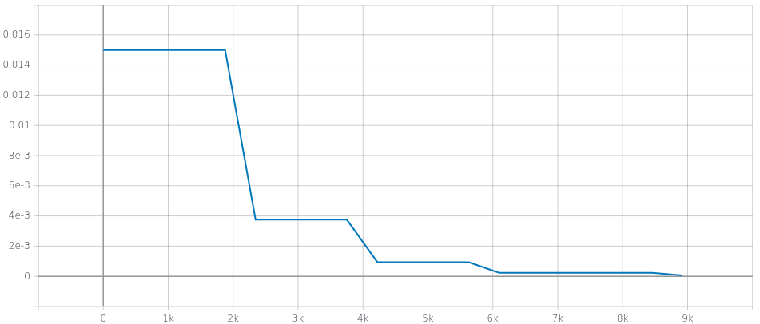
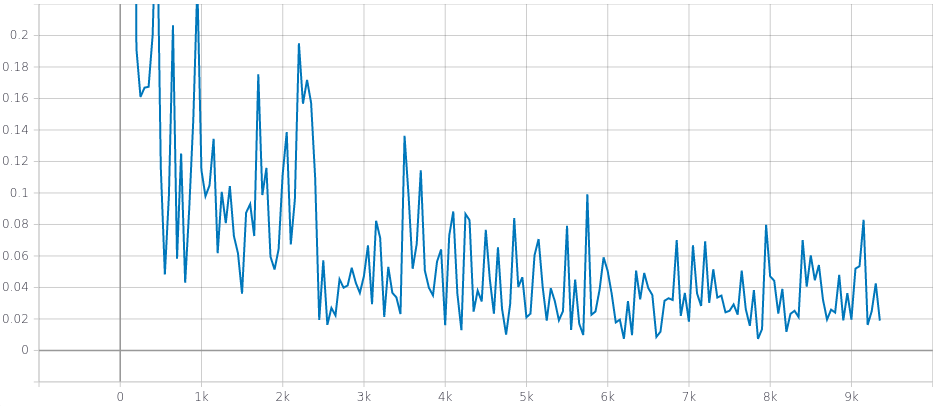

= Robustness of Neural Ordinary Differential Equations

This readme file is an outcome of the http://kovan.ceng.metu.edu.tr/~sinan/DL/[CENG501 (Spring 2021)] project for reproducing a paper without an implementation. See https://github.com/sinankalkan/CENG501-Spring2021[CENG501 (Spring 2021) Project List] for a complete list of all paper reproduction projects.

== 1. Introduction

This document describes the project to implement and reproduce results from the paper "Robustness of Neural Ordinary Differential Equations"^<<1>>^. Technically, the goal is to implement the models described in the paper. Additionally, this project aims to educate the investigators about the subjects involved in the work and provide practical experience in implementing state-of-the-art deep learning models.

=== 1.1. Paper summary 

This paper examines the robustness of deep networks based on neural ordinary differential equations (NeuralODE)^<<2>>^ compared to convolutional neural networks. Robustness is evaluated using classification accuracy of networks trained using three different datasets and three attacks. The three datasets used for the study are MNIST digits, street view house numbers (SVHN), and a subset of ImageNet. The three attacks used were addition of Gaussian noise, FGSM, and PGD. While Gaussian noise is random input corruption not tailored at all to the network under attack, FGSM and PGD utilize knowledge of the network model for gradients (i.e. they are "white box" attacks).

In addition to the robustness analysis, the authors of the paper present a novel modification to the NeuralODE network. They call their new network as "time invariant steady-state ODE" or TisODE. This new network seeks to increase the range of inputs which tend toward the same output by utilizing a time invariant ODE layer with regularization to encourage the ODE layer function to have a small values at the end of the integration range.

== 2. The method and my interpretation

=== 2.1. The original method

The paper examines the robustness characteristics of neural ODEs compared to convolutional neural networks. Although neural ODEs are not a novelty of this paper, we will give a brief introduction to the concept as applied in deep classification networks. The neural ODE layer numerically integrates the output of a function block over a specified time range (e.g. 0 to 1). The input to the neural ODE layer serves as the initial point x~0~ of the integrated function. The final value x~f~ at time t~f~ is used as the output of the neural ODE layer that is subsequently passed to the following layers of the classification network. The function to be integrated is learned during the training process and in general is a function of both the current state value x and also time t.

The paper proposes a novel TisODE model that is a variant of a neural ODE layer. The general neural ODE layer is modified in two ways. The first modification is to eliminate the time input to the block that is the function to be integrated in the neural ODE layer. This makes the ODE to become time invariant. The second modification is to add a steady-state regularization term. The new regularization term is formed by an additional integration period from t~f~ to 2t~f~ in which we accumulate the absolute value of the derivative being integrated in the neural ODE layer. The norm of the accumulated absolute value is used as a weighted regularizing term in the loss function for training the network. This serves to encourage the neural ODE block to have small derivative outputs at the end of the integration range.

The idea behind the TisODE is that the time-invariant function will converge toward the same output values even for small variances in the input values, thus improving the robustness of the network.

Some hyperparameters of the networks and training process being used for the investigation are given in the paper.

- Classification accuracy (%) is reported as the evaluation metric of the various models.
- Neural ODE network configurations are described.
- Weight decay = 0.0005. Able to use directly.
- The TisODE steady-state loss weight is specified as 0.1. From correspondence with the paper's author, we learned that the steady-state loss was not always set to 0.1 but sometimes other values such as 0.05 or 0.01 were used. Due to issues with training, we used 0.01.
- The feature denoising method is specified as dot-product non-local. This method is described in ^<<3>>^ and has a reference implementation in TensorFlow that we could adapt to PyTorch for this project.

=== 2.2. My interpretation

Some implementation details and hyperparameters are not given in the paper, so we made our own choices for them.

- The random seed values for initialization aren't provided, so three arbitrary seed values were selected.
- Input randomization^<<4>>^ output size was selected to be 40 for the MNIST networks, 36 for the SVHN networks, and xx for the ImageNet networks.
- Group norm number of channels in each group is set to the lesser of the number of channels or 32, matching the implementation of the torchdiffeq Neural ODE library demo network.
- Normalization. Each dataset is pre-processed by normalizing to a mean of 0 and standard deviation of 1.
- CNN network configuration not specified. Assumed to be the same as the ODE network.
- Training batch size. Set to 128.
- Loss function. Since the problem is classification, negative-log likelihood (NLL) loss function is used.
- Optimization method. Using Adams method with pytorch default hyperparameters.
- Learning rate. Set to initial rate of 0.015 for MNIST and 0.001 for SVHN and decrease by 25% when validation loss doesn't decrease by 0.001 (MNIST) or 0.02 (SVHN) for 2 epochs.
- Maximum number of epochs for training set to 250 but with early stopping if at least 0.002 (MNIST) or 0.02 (SVHN) improvement in validation loss is not seen in 5 epochs for CNN and ODENet models and 10 epochs for TisODE models.
- Training vs validation split not specified but we decided to use such a split for monitoring training progress. Approximately 10% of the training data was set used for validation.
- Classification accuracy was calculated over the test set for each dataset. (The original public "validation" set is used as the test set by the PyTorch dataset modules.)
- PGD adversarial attack uses a specified number of iterations to optimize the attack. The number of iterations is not specified in the paperm but the author clarifies in https://openreview.net/forum?id=B1e9Y2NYvS&noteId=r1xirtM4tB[a comment] during the review process that 10 steps were used. However, the Foolbox default is 40 https://foolbox.readthedocs.io/en/stable/modules/attacks.html#foolbox.attacks.LinfProjectedGradientDescentAttack[according to the documentation], but decreasing the step size alone and leaving the other Foolbox PGD attack parameters the same resulted in relatively ineffective attack, so all Foolbox defaults were left.

== 3. Experiments and results

=== 3.1. Experimental setup

We implemented the networks using https://pytorch.org/[PyTorch] and https://www.pytorchlightning.ai/[PyTorch Lightning]. Gaussian noise was added with a custom function written using PyTorch random number generator. Neural ODE equations were solved using the https://github.com/rtqichen/torchdiffeq[torchdiffeq] Neural ODE library. FGSM and PGD adversarial attack samples were created using the https://github.com/bethgelab/foolbox[FoolBox] library. https://colab.research.google.com/[Google Colab] with GPU runtime was used for running the notebooks.

The MNIST and SVHN datasets were loaded using torchvision.datasets. The subset of the ImageNet dataset was created by downloading all of the ImageNet 2012 dataset and then extracting images in the stated categories off-line using a combination of custom Python scripts and manually moving files. This "ImageNet10" dataset was uploaded to Google Drive and can be downloaded from https://drive.google.com/drive/folders/16x-aUfBRtH6BD-fbJB-DqTRtl6S2X-MW?usp=sharing[this link].

Training and robustness evaluation was done in Colab notebooks with separate notebooks for each of the three datasets and some common code in a utils.py file. Trained models were saved and subsequently loaded for robustness evaluation.

PyTorch Lightning callbacks were used to save the top 3 models during each training run and the best model saved for the robustness analysis. Training progress metrics were saved to TensorBoard logs for further analysis.

Implementing the TisODE model was particularly challenging. Using the formula for L_ss as given in Equation 5 in the paper, the steady-state regularization loss term overwhelms the negative-log likelihood loss such that training frequently diverged for practical learning rates. We used batch mean of the steady-state norm rather than the batch sum of the steady-state norm. With this change, the given loss weight worked to train the network. Correspondence with the author confirmed that the original work was implemented this way. The author also trained the network for several epochs without the steady-state regularization term included before adding it in. We likewise adopted this practice, delaying the inclusion of the steady-state regularization loss term for 5 epochs, then adding it with a 0.01 multiplier for 2 epochs, then adding it with a 0.1 multiplier for 2 epochs, then adding it at the full specified weight for the remainder of training. Since this naturally bumps up the loss value when regularization kicks in, large constant values were added to the loss so that overall the loss would be decreasing and not confuse the plateau or early stopping monitors.

=== 3.2. Running the code

The notebooks are written for running on Google Colab and mounting data on Google Drive. The notebooks and `utils.py` are expected to be on the Google Drive under `Colab Notebooks/CEng501 Project/`. Other platforms can be used be modifying the drive mounting code accordingly. Persistent data is stored under the MNIST, SVHN, and ImageNet directories. The MNIST and SVHN datasets will be downloaded automatically. The custom ImageNet10 dataset can be downloaded from Google Drive using https://drive.google.com/drive/folders/16x-aUfBRtH6BD-fbJB-DqTRtl6S2X-MW?usp=sharing[this link]. The Imagenet10 train and val directories are expected to be available under `ImageNet/ImageNet/` relative to the notebook.

All dependencies are available within the current runtime available for Google Colab except for packages that are installed by pip commands in the shell in the notebook.

There are three code notebooks--one for each dataset--and a shared project library `utils.py` that comprise the code of this projct. Each notebook can be run using "Run All", but the run time may be excessive to complete it all in one run. To accomodate training the models over the course of multiple sessions, in the Setup section at the top of each notebook, there is a cell named `models_to_train` that defines a set of which models are to be trained.

=== 3.3. Results

The MNIST and SVHN datasets each have 4 CNN models, 2 ODENet models, and 3 TisODE models, each trained with three different seeds for a total of 27 models for each dataset to train. Even with plateau-based learning rate scheduling and early stopping, using Google Colab high-memory GPU instances, for each random number seed, the CNN models take 3-6 minutes to train, ODENet models take about 10 minutes to train, and the TisODE models take about 15-30 minutes to train. Total training time for the final MNIST and SVHN models on Google Colab is estimated to have been approximately 13 hours. The TensorBoard logs and best models of the final training runs are available in this repository. The testing routine also took significant time to run. Specifically, the PDG adversarial attack tests take approximately 50% of the time that it took to train the models.

Below is the adjusted learning rate and loss curve from TensorBoard for one training run, presented as an example. This training run is for the CNN Net model with seed value of 23, trained with the augmented data set (started at 2021/07/14 at 10:15:25 UTC).

.Example Learning Rate Curve

.Example Training Loss Curve

Results from the original paper are presented alongside the results obtained from our implementation. For ease of comparison, the results are are interleaved so that results from our implementation immediately follow results from the original paper.

.Models trained with non-perturbed images
|===
|      3+| Gaussian noise     3+| Adversarial attack

|*MNIST*       | *σ = 50* | *σ = 75* | *σ = 100* | *FGSM-0.15* | *FGSM-0.3* | *FGSM-0.5*
|CNN (paper) | 98.1±0.7 | 85.1±4.3 | 56.4±5.6 | 63.4±2.3 | 24.0±8.9 | 8.3±3.2
|CNN (ours)  | 98.5±0.0 | 94.5±1.1 | 77.8±4.2 | 67.7±3.7 | 27.7±3.6 | 9.9±2.0
|ODENet (paper) | 98.7±0.6 | 90.6±5.4 | 73.2±8.6 | 83.5±0.9 | 42.1±2.4 | 14.3±2.1
|ODENet (ours)  | 98.9±0.1 | 96.5±0.8 | 87.4±4.8 | 84.6±1.5 | 49.6±3.0 | 18.5±1.2
|*SVHN*       | *σ = 15* | *σ = 25* | *σ = 35* | *FGSM-3/255* | *FGSM-5/255* | *FGSM-8/255*
|CNN (paper) | 90.0±1.2 | 76.3±2.7 | 60.9±3.9 | 29.2±2.9 | 13.7±1.9 | 5.4±1.5
|CNN (ours)  | 87.4±0.4 | 75.2±1.0 | 61.8±1.4 | 35.2±0.7 | 18.0±0.3 | 7.7±0.3
|ODENet (paper) | 95.7±0.7 | 88.1±1.5 | 78.2±2.1 | 58.2±2.3 | 43.0±1.3 | 30.9±1.4
|ODENet (ours)  | 90.8±0.7 | 82.7±1.6 | 72.1±2.2 | 62.8±0.9 | 46.2±0.5 | 31.0±0.6
//|*ImgNet10*       | *σ = 10* | *σ = 15* | *σ = 25* | *FGSM-5/255* | *FGSM-8/255* | *FGSM-16/255*
//|CNN (paper) | 80.1±1.8 | 63.3±2.0 | 40.8±2.7 | 28.5±0.5 | 18.1±0.7 | 9.4±1.2
//|CNN (ours)  | xx±xx | xx±xx | xx±xx | xx±xx | xx±xx | xx±xx
//|ODENet (paper) | 81.9±2.0 | 67.5±2.0 | 48.7±2.6 | 36.2±1.0 | 27.2±1.1 | 14.4±1.7
//|ODENet (ours)  | xx±xx | xx±xx | xx±xx | xx±xx | xx±xx | xx±xx
|===

.Models trained with original images along with perturbed images
|===
|      | Gaussian noise     4+| Adversarial attack

|*MNIST*       | *σ = 100* | *FGSM-0.3* | *FGSM-0.5* | *PGD-0.2* | *PGD-0.3*
|CNN (paper) | 98.7±0.1 | 54.2±1.1 | 15.8±1.3 | 32.9±3.7 | 0.0±0.0
|CNN (ours)  | 97.9±0.4 | 52.4±2.7 | 16.5±2.2 | 43.3±1.1 | 0.6±0.3
|ODENet (paper) | 99.4±0.1 | 71.5±1.1 | 19.9±1.2 | 64.7±1.8 | 13.0±0.2
|ODENet (ours)  | 98.4±0.1 | 69.3±2.4 | 28.4±1.2 | 72.8±0.5 | 20.2±0.6
|TisODE (paper) | 99.6±0.0 | 75.7±1.4 | 26.5±3.8 | 67.4±1.5 | 13.2±1.0
|TisODE (ours)  | 77.5±19.9 | 35.3±24.8 | 14.7±7.1 | 36.2±35.2 | 7.3±9.6
|*SVHN*       | *σ = 35* | *FGSM-5/255* | *FGSM-8/255* | *PGD-3/255* | *PGD-5/255*
|CNN (paper) | 90.6±0.2 | 25.3±0.6 | 12.3±0.7 | 32.4±0.4 | 14.0±0.5
|CNN (ours)  | 85.5±0.3 | 32.4±0.8 | 16.7±0.8 | 48.1±0.1 | 24.5±0.3
|ODENet (paper) | 95.1±0.1 | 49.4±1.0 | 34.7±0.5 | 50.9±1.3 | 27.2±1.4
|ODENet (ours)  | 86.0±1.7 | 53.4±4.0 | 36.7±4.0 | 67.9±3.6 | 47.5±4.2
|TisODE (paper) | 94.9±0.1 | 51.6±1.2 | 38.2±1.9 | 52.0±0.9 | 28.2±0.3
|TisODE (ours)  | 66.4±5.4 | 38.2±5.3 | 24.6±4.1 | 51.7±5.7 | 34.8±5.2
//|*ImgNet10*       | *σ = 25* | *FGSM-5/255* | *FGSM-8/255* | *PGD-3/255* | *PGD-5/255*
//|CNN (paper) | 92.6±0.6 | 40.9±1.8 | 26.7±1.7 | 28.6±1.5 | 11.2±1.2
//|CNN (ours)  | xx±xx | xx±xx | xx±xx | xx±xx | xx±xx
//|ODENet (paper) | 92.6±0.5 | 42.0±0.4 | 29.0±1.0 | 29.8±0.4 | 12.3±0.6
//|ODENet (ours)  | xx±xx | xx±xx | xx±xx | xx±xx | xx±xx
//|TisODE (paper) | 92.8±0.4 | 44.3±0.7 | 31.4±1.1 | 31.1±1.2 | 14.5±1.1
//|TisODE (ours)  | xx±xx | xx±xx | xx±xx | xx±xx | xx±xx

|===

.Models with drop-in robustness improvement techniques
|===
|      | Gaussian noise     4+| Adversarial attack

|*MNIST*       | *σ = 100* | *FGSM-0.3* | *FGSM-0.5* | *PGD-0.2* | *PGD-0.3*
|CNN (paper) | 98.7±0.1 | 54.2±1.1 | 15.8±1.3 | 32.9±3.7 | 0.0±0.0
|CNN (ours)  | 97.9±0.4 | 52.4±2.7 | 16.5±2.2 | 43.3±1.1 | 0.6±0.3
|CNN-FDn (paper) | 99.0±0.1 | 74.0±4.1 | 32.6±5.3 | 58.9±4.0 | 8.2±2.6
|CNN-FDn (ours)  | 98.1±0.1 | 60.6±5.2 | 23.8±4.7 | 49.0±7.4 | 4.1±1.4
|TisODE-FDn (paper) | 99.4±0.0 | 80.6±2.3 | 40.4±5.7 | 72.6±2.4 | 28.2±3.6
|TisODE-FDn (ours)  | 87.0±6.0 | 26.9±19.5 | 12.5±7.9 | 23.6±23.8 | 2.5±3.2
|CNN-IRd (paper) | 95.3±0.9 | 78.1±2.2 | 36.7±2.1 | 79.6±1.9 | 55.5±2.9
|CNN-IRd (ours)  | 97.5±0.2 | 53.5±5.9 | 13.5±3.4 | 58.1±5.3 | 3.8±1.7
|TisODE-IRd (paper) | 97.6±0.1 | 86.8±2.3 | 49.1±0.2 | 88.8±0.9 | 66.0±0.9
|TisODE-IRd (ours)  | 57.6±9.7 | 6.2±4.3 | 4.3±2.3 | 2.5±3.8 | 0.1±0.2
|*SVHN*       | *σ = 35* | *FGSM-5/255* | *FGSM-8/255* | *PGD-3/255* | *PGD-5/255*
|CNN (paper) | 90.6±0.2 | 25.3±0.6 | 12.3±0.7 | 32.4±0.4 | 14.0±0.5
|CNN (ours)  | 85.5±0.3 | 32.4±0.8 | 16.7±0.8 | 48.1±0.1 | 24.5±0.3
|CNN-FDn (paper) | 92.4±0.1 | 43.8±1.4 | 31.5±3.0 | 40.0±2.6 | 19.6±3.4
|CNN-FDn (ours)  | 85.7±1.4 | 39.4±0.4 | 24.5±0.7 | 49.9±2.3 | 27.1±2.2
|TisODE-FDn (paper) | 95.2±0.1 | 57.8±1.7 | 48.2±2.0 | 53.4±2.9 | 32.3±1.0
|TisODE-FDn (ours)  | 66.7±1.1 | 39.3±0.2 | 26.5±0.6 | 51.7±0.7 | 34.5±0.7
|CNN-IRd (paper) | 84.9±1.2 | 65.8±0.4 | 54.7±1.2 | 74.0±0.5 | 64.5±0.8
|CNN-IRd (ours)  | 83.4±2.1 | 39.1±2.3 | 22.1±1.9 | 56.9±1.4 | 32.6±1.5
|TisODE-IRd (paper) | 91.7±0.5 | 74.4±1.2 | 61.9±1.8 | 81.6±0.8 | 71.0±0.5
|TisODE-IRd (ours)  | 52.2±10.8 | 31.2±5.9 | 20.1±4.1 | 42.5±7.6 | 29.0±4.9
|===

== 4. Conclusions

The results show some cases where our results were similar to the published results, but there are also many cases where the results are quite different. These differences could be due to various factors including

- assumptions made to fill in information not provided in the original paper that actually don't match the original author's implementation
- implementation errors on our part
- random variances due to using different seeds

Our implementation of feature denoising and input randomization do not seem to improve robustness very significantly compared to models without it. This leads us to wonder whether the implementations are correct.

Apart from the correctness of the output of our implementation, as an educational exercise, we were able to implement a deep learning project including adversarial attacks and neural ODE blocks. We learned to customize the training loop using PyTorch Lightning. We went through many iterations of (very time consuming!) troubleshooting in the implementation phase. In some cases, it was remarkable how well the network was able to learn even when coding errors caused it to be wrongly configured.

The TisODE model proved to be very difficult to train due to the steady-state regularization term and long training times. Sometimes with a too low value for the learning rate, the Adam optimizer would diverge with steadily increasing loss values. Without "tricks" like the delayed inclusion of the regularization term, the model could not exceed very poor test accuracies. Even with delayed inclusion of steady-state regularization, the model often stayed "stuck" at relatively poor accuracies due to the regularization. It seemed to be more sensitive to the initial seed value and training hyperparameters than other models. One possible explanation is that the regularization term is trying to drive the output of the ODE function toward zero where the output matches a classified image. However, if the output is zero everywhere, then this layer is not doing anything to help with classification.

With the caveat that our implementation of the TisODE model may not be correct, our results did not confirm the usefulness of this model. It was difficult to train and had poor accuracy on unmodified input images and no significant improvement for adversarial attacks. In this regard, we were not able to confirm one of the original authors' main contributions presented in their paper.

With regard to the original paper's conclusion that Neural ODE networks have improved robustness compared to CNNs, while our results do not closely match the original paper's in all cases, the output that we obtained seems to confirm the robustness improvement of using Neural ODEs rather than CNNs.

== 5. References

[#1]
^[1]^ Hanshu Yan, Jiawei Du, Vincent Tan, Jiashi Feng. On Robustness of Neural Ordinary Differential Equations. International Conference on Learning Representations, 2020. https://openreview.net/forum?id=B1e9Y2NYvS[(online)]

[#2]
^[2]^ Tian Qi Chen, Yulia Rubanova, Jesse Bettencourt, and David K Duvenaud. Neural ordinary differential equations. In Advances in Neural Information Processing Systems, pp. 6571–6583, 2018. https://papers.nips.cc/paper/7892-neural-ordinary-differential-equations[(online)]

[#3]
^[3]^ Cihang Xie, Yuxin Wu, Laurens van der Maaten, Alan L Yuille, and Kaiming He. Feature denoising for improving adversarial robustness. In Proceedings of the IEEE Conference on Computer Vision and Pattern Recognition, pp. 501–509, 2019. https://arxiv.org/abs/1812.03411[(online)]

[#4]
^[4]^ Cihang Xie, Jianyu Wang, Zhishuai Zhang, Zhou Ren, and Alan Yuille. Mitigating adversarial effects through randomization. International Conference on Learning Representations, 2018. https://arxiv.org/abs/1711.01991[(online)]

== Contact

https://github.com/pdb5627/[Paul Brown]

https://github.com/SABDULLAHJ/[Syed Abdullah Jelani]

== Contributions

Paul

- Set up initial notebooks on Google Colab
- Download ImageNet 2012 dataset and extract relevant image classes to directories
- Code MNIST & SVHN models and training loop using PyTorch Lightning
- Code testing loop and integrate Foolbox adversarial attack
- Create GitHub repo and begin drafting report (later moved to Sinan Hoca's repo)
- Adjust hyperparameters for MNIST & SVHN models, train models, and copy results into output report

Abdullah

- Code parameterized additive Gaussian noise image transform
