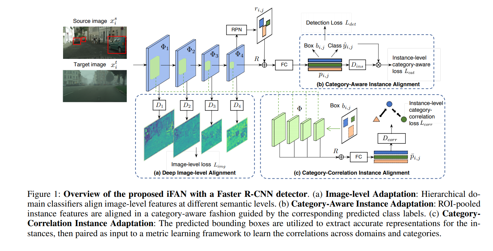
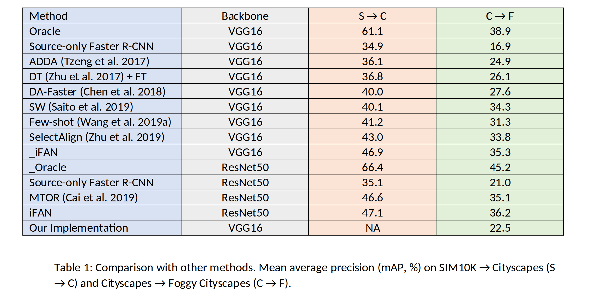
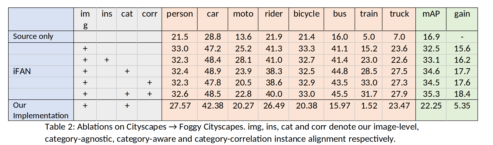

# Paper title
iFAN: Image-Instance Full Alignment Networks for Adaptive Object Detection
Chenfan Zhuang, Xintong Han, Weilin Huang∗, Matthew R. Scott

This readme file is an outcome of the [CENG501 (Spring 2021)](http://kovan.ceng.metu.edu.tr/~sinan/DL/) project for reproducing a paper without an implementation. See [CENG501 (Spring 2021) Project List](https://github.com/sinankalkan/CENG501-Spring2021) for a complete list of all paper reproduction projects.

# 1. Introduction

Most state-of-the-art DL-based object detection approaches presume that training and test data come from the same distribution. These detection models require a significant number of annotated training samples. However, in practice, collecting annotated data is time-consuming and costly. To solve this problem, deep domain adaptation has emerged as a new learning model. Deep domain adaptive object detection aims to learn a robust object detector using the label-rich data of the source domain and the label-poor data of the target domain, the learning process is based on domain adaptive models The distributions between source and target are completely different. The expectation for trained object detector is performing well in the target domain.

## 1.1. Paper summary

To reduce the cost for human labeling, neural network is trained on one domain that generalizes well on another domain. Image classification, object detection, semantic segmentation are the examples of tasks where domain adaptation is used. 
Previous studies are generally based on aligning deep features between source and target domain. Also, the alignment is generally achieved by domain-adversarial training at different levels of object detectors. Domain-adversarial training methods use domain discriminators and conduct adversarial training to encourage domain confusion between source domain and target domain.
In this paper they also follow this approach to develop multi-level domain alignments. However, rather than using single convolutional layer, they design hierarchically nested domain discriminators. They developed a method which use an architecture to reduce annotation cost and have better outputs with an adaptive object detection method.

# 2. The method and my interpretation

## 2.1. The original method
In the original method, baseline object detection module is faster rcnn with backbone as either vgg16 or resnet50 CNN's. On top of this object detection model, authors propose a modified method which can increase the model's performance on different domains. Proposed adaptation methods which authors included are Image-level Adaptation, Category-Aware Instance Adaptation, Category-Correlation Instance Adaptation all of which can be observed in figure 1. In Image-level Adaptation intermediate steps in backbone classifier are forwarded to a 1-D Fully Convolutional Network-Domain Classifiers. Loss of this network is acquired as mean square-error loss and its aim is to minimize the effect of domain shifts. In Category-Aware Instance Adaptation, after ROI-Align the features of proposed rois are fed to a category instance domain classifier which author proposes as the same architecture as the Image-level Adaptation part. After this network each roi has its domain discriminator and with the category probability of each roi loss is obtained. This is implemented in order to align the same category features in both datasets/domains. Although, this loss is incorporated to the general loss after some point/late launch because author observed that at the beginning of training it lowers the mAP. In last implementation which is Category-Correlation Instance Adaptation, the intermediate layers in backbone classifier are taken and processed with proposed bounding boxes with ROI-Align. This process generates 4 outputs, which then passed through 1x1 Convolutions to generate outputs with 256 channels. These outputs are added and passed through a FCN which outputs a metric discriminator between instances. Loss of this network is obtained by taking only same-domain different-category and different-domain same-category instances which then minimizes contrastive loss explained in the article. This is implemented in order to refine proposed bounding boxes. Before data is fed to these proposed structures, it is fed to a gradient reversal layer then followed by the proposed models.


After constructing these structures the network is trained end to end. A batch of images from source and target dataset is fed to the network. Detector losses are only obtained from the source dataset and the remaining losses which author includes are obtained from both source and target datasets. This way observing the domain adaptation on target dataset becomes more objective.

## 2.2. My interpretation 

The models which author implemented namely Image-level Adaptation, Category-Aware Instance Adaptation, Category-Correlation Instance Adaptation were all not explained in detail aside from Image-level Adaptation part. In image-level adaptation part a fully convolutional network is implemented and mean squared error losses are taken for the output. In Category-Correlation Instance Adaptation part a Fully connected network is implemented instead of the proposed 1x1 CNN structure. The output dimension weren't clear on how to implement such structure and the reference which author mentions,da-faster-rcnn, uses a fully connected network as the category instance domain classifier. The sample network was category-agnostic and it was changed to output categories as well for similarity to the paper. Lastly in Category-Correlation Instance Adaptation the network which author proposes isn't explained in any detail whatsoever and the loss which takes same-domain different-category and different-domain same-category instances isn't properly understood as well so we decided not to implemented as we didn't have a proper idea for what the authors had in mind at this part and it didn't seem like it had a significant effect on the results as the other implementations. Before the implemented networks a gradient reversal layer is applied to match the implementation in the paper.For the backbone structure, authors generally included and mentioned vgg16 in their results so we decided to implement these on vgg16 network. Authors provide that they activate late launch for Category-Correlation Instance Adaptation at around 50K iterations but we couldn't train for that long because lack of hardware and decided to activate it 1/3 of the maximum epochs.


# 3. Experiments and results

## 3.1. Experimental setup

In original setup authors use SIM10K to Cityscapes and Cityscapes to Foggy Cityscapes dataset. Because of lack of disk space in Colab at this part we could only implement Cityscapes to Foggy Cityscapes to some extent. In these datasets we have only taken berlin, leverkusen, aachen, hamburg, hanover, stuttgart, zurich and frankfurt as the datasets from the Cityscapes datasets. Learning rate is kept the same as 0.001 as in the paper but the iteration count couldn't be kept the same, authors didn't provide also but the provide that they start Category-Correlation Instance Adaptation at 50K iterations which we couldn't train for that long as Colab limits gpu usage. All the other model parameters and settings were applied the same.

## 3.2. Running the code

Our directory structure looks identical to the implementation of faster rcnn structure. Since faster rcnn is the baseline structure for the proposed method we have directly taken the implemented version. In .ipynb file the whole training and testing structure is given as well. Firstly in prepare_data directory the datasets are downloaded and extracted. Since the datasets are essentially segmentation datasets they need to be converted to bounding box structure. We have followed pascal voc format for the extracted bounding boxes. These extractions are implemented as turn.py and turn_foggy.py which namely converts Cityscapes and Foggy Cityscapes datasets to pascal voc format. After this, the pascal voc format data is moved to data directory. In this directory pretrained vgg16 is also downloaded. In lib directory setup.py is ran with develop as the extension to build cpp source codes. After these the structure is ready to be trained with run.py which outputs the trained model at every epoch. The following script is ran to start training when all the configurations are done. To understand these configurations more thoroughly given Train&TestExample.ipynb notebook can be analyzed.
```shell
!python3 run.py train --net vgg16 --dataset voc_2007_trainval --total_epoch 100 -bs 2 --cuda --add_params devkit_path=VOCdevkit
```
For testing and getting the output mAP's following script is ran.
```shell
!python3 run.py test --net vgg16 --dataset voc_2007_test --epoch 100 --cuda --add_params devkit_path=VOCdevkit_foggy
```
devkit_path here indicates the dataset directory. Since the test dataset is Cityscapes foggy it only takes foggy dataset here. Another note here is that the minimum batch size of the network is 2. This is applied to ensure one iteration takes one source dataset image and one target dataset image for the given batch size 2. In essence the given batch size is divided to 2 and each dataset is iterated with half of the total batch size.
## 3.3. Results
In table 1, the mAP results of the similar domain adaptive models can be seen. As we couldn't fully utilize the dataset and train until convergence our model's mAP results appear subpar compared to the other models. Although not very significant or reliable, our model seems to have outperform the baseline faster r-cnn model by %5.6 mAP on the test dataset. The test dataset only consists of images from foggy cityscapes dataset so it measures the adaptivity of the network. Comparing our model with the vgg-16 iFAN model our model is lower by %12.8.

In table 2, iFAN model's and baseline faster-rcnn model's mAP values are given for each category with the mean mAP. img, ins, cat and corr columns are the network's/losses implemented on top of the baseline model. As we have discussed before we decided to implement image-level and category-aware losses. Looking at the mAP's it can be clearly seen that our network performed terribly on train category. This may be due to the lack of train classes in the dataset portion that we have used. General accuracies seem similar, although lower, compared to the other implementations of the iFAN model. 


# 4. Conclusion

In conclusion, from the general mAP's of the categories compared to the iFAN models and the fact that our model outperforms the baseline faster-rcnn in the test set, it can be said that the structure we have implemented is somewhat correct as from the perspective of domain adaptation there was an increase of mAP. Results couldn't be identically experimented on for iFAN dataset because of the lack of reproductibility of the paper as the proposed architecture's explanations are very vague. The comparison of the models isn't completely objective as well since we could only manage to use a portion of the dataset and couln't train until convergence. Overall we think that the general structure is close to being correct because of the reasons that we have mentioned before.

# 5. References

Zhuang, Chenfan & Han, Xintong & Huang, Weilin & Scott, Matthew. (2020). iFAN: Image-In-stance Full Alignment Networks for Adaptive Object Detection.

M. Cordts, M. Omran, S. Ramos, T. Rehfeld, M. Enzweiler, R. Benenson, U. Franke, S. Roth, and B. Schiele, “The Cityscapes Dataset for Semantic Urban Scene Understanding,” in Proc. of the IEEE Conference on Computer Vision and Pattern Recognition (CVPR), 2016.

faster-rcnn-pytorch, (2020), GitHub repository, https://github.com/loolzaaa/faster-rcnn-pytorch

Chen, Yuhua, vd. “Domain Adaptive Faster R-CNN for Object Detection in the Wild”. arXiv:1803.03243 [cs], Mart 2018. arXiv.org, http://arxiv.org/abs/1803.03243.

# Contact

Sena EŞME - sena.esme@metu.edu.tr
Batuhan VARDAR - batuhan.vardar@metu.edu.tr

