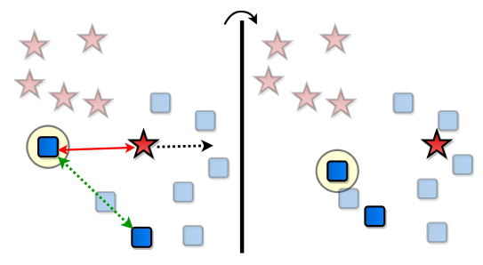
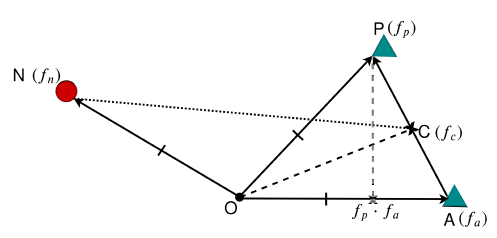

# [Moving in the Right Direction: A Regularization for Deep Metric Learning](https://openaccess.thecvf.com/content_CVPR_2020/html/Mohan_Moving_in_the_Right_Direction_A_Regularization_for_Deep_Metric_CVPR_2020_paper.html)

This readme file is an outcome of the [CENG501 (Spring 2021)](http://kovan.ceng.metu.edu.tr/~sinan/DL/) project for reproducing a paper without an implementation. See [CENG501 (Spring 2021) Project List](https://github.com/sinankalkan/CENG501-Spring2021) for a complete list of all paper reproduction projects.

# 1. Introduction

This repository is the implementation of the CVPR 2020 paper written by Deen Dayal Mohan et al. Please refer to the paper for a detailed explanation. Moving in Right Direction (MVR) paper tries to solve the metric learning problem, which aims to construct embedding space where distance is inversely correlated with semantic similarity. Metric learning has many practical applications such as image retrieval, face verification, person re-identification, few-shot learning, etc. Image retrieval aims to bring samples as same class as the given query image. MVR paper introduces direction regularization to prevent the unaware movement of samples. Therefore, their methodology improves the performance of retrieval tasks compared to a method without regularization. We aim to quantitatively validate retrieval performance increases and visualize retrieval results to see the capability of deep metric learning during this repository.

## 1.1. Paper summary

The paper proposes to to add a Direction Regularizaiton(DR) to metric learning losses which are Proxy Loss, Triplet Loss and MS Loss. It is mentioned that DR is also applicable to other metric learning losses. In order to prove effectiveness of the proposed regularization, they test aforementioned losses it on CUB-200-2011, Cars-196, In-Shop Clothes Retrieval datasets both with the addition of regularization and without regularization. The results show that addition of DR improves the performance.

# 2. The method and my interpretation

## 2.1. The original method

The idea of metric learning is that samples of same class should be close to each other in the embedding space and samples of different classes should be away from each other. Thus, when a anchor, negative and positive are chosen existing loss methods moves toward the positive and the negative moves away from the anchor. However this may lead lead to undesired situations such as pushing the negative into the positives. This situation is shown in Figure 1. The problem results from the existing losses not taking into account that the negative might be placed in the positives or the positive might be placed in the negatives. 

<p align="center">
  
</p>
<p align="center">
  Figure 1 (Figure 1 of paper)
</p>
This paper aims to correct the direction where samples are pushed by Direction Regularization (DR). Methods suggests rather than naively pushing the negative sample away from the anchor, following two constraints should be applied:negative sample should be pushed away from the middle of the anchor and the positive rather than being pushed away from the anchorthe anchor-positive line should be orthogonal to the line that connect the negative and the middle of anchor and the positive (Figure 2).

<p align="center">
  
</p>
<p align="center">
  Figure 2 (Figure 3 of paper)
</p>


The paper improves the performance of current state-of-the-art methods and develops a generalized approach that can be applied any other loss function that exist/will be developed.


## 2.2. My interpretation 

The method is best understood on triplet loss example, so the authors develop the idea on the triplet loss and then generalize to other loses. Thus, though the derivations and formulations are detailed for triplet loss, the same does not apply to other losses. 

The method seems to be like developed for the triplet loss and then generalized for other losses. There are two reasons for this. The first is that DR is most suitable for triplet loss and the second is that paper mostly focuses on triplet loss. 

As remarked in the previous section MS (Multi Similarity) loss part was not deeply explained. The most confusing part was what f_p was in Eqn. 15. f_a is the anchor indexed with “i”, f_n is the negative sample indexed with “n” but f_p was unclear. In the paragraph above “hardest positive” was mentioned. Later it was confirmed that it is the hardest positive with respect to associated anchor by contacting the authors.

Another challenging part was  replicating the results since the hyper parameters were not declared. Later this issue was partly solved by using a hyper parameter optimizer(optuna). Also how validation and test sets were separated was unclear.

The idea makes sense and proven to improve performance. The general framework to regularize direction for losses very simple and concise. Although it increases the computational cost, it does not increase the computational complexity (in terms of big O notation). The paper touches on an important matter which has not been discovered before. The paper is not limited to improving performance, it also exploits the importance of direction regularization for losses. Thus, it opens new doors in metric learning field. 

# 3. Experiments and results

## 3.1. Experimental setup

As model, MVR paper utilizes pretrained GoogleNet with Batch Normalization on ImageNet. Although they do not express which pretrained model they use, we choose caffe pretrained model due to superiority over pytorch pretrained model. The caffe model only perform zero mean preprocessing to the dataset compared to torch model that applies not only zero mean but also scaling of the dataset as a preprocessing. As mentioned in the paper, we augment train dataset with random cropping and random horizontal flip while test set is center cropped. We evaluate performance on CUB-200-2011 dataset but it is easily generalizable to other dataset. CUB dataset is split into two equal part as train and test set in the MVR paper ;however, they do not mention existence of validation set. Therefore, we assume that they do not use validation set. This fact is mentioned in Metric Learning Reality Check paper that majority of paper do not use validation set [[1]](#1). We choose embedding dimension size as 64 like the paper. MVR paper do not share margin and regularization parameters of triplet. Therefore, we have to optimize this hyperparameter with OPTUNA. As results of optimization, we find margin and regularization as 0.2781877469005122 and 0.4919607680052035 respectively. We also have no information about batch size. Since higher batches results with diverse pairs and triplets, we try to keep batch size respectively high. So we choose batch size as 128 for direction regularized triplet. Since one hyper-parameter exists for proxy loss, we also apply grid search to regularization constant with increment of 0.05. After grid search, optimal regularization constant for proxy is founded as 0.30.

## 3.2. Running the code

```
.
├── dataloader
│      ├── cub_dataset.py
│      ├── sampler.py
│      ├── trsfrms.py
├── evaluation
│      ├── recall.py
├── loss
|      ├── deneme.py
|      ├── mvrloss.py
├── model
|      ├── bn_inception.py
├── data
|      ├── CUB_200_2011
|          ├── images
├── log
├── hyper_train.py
├── test.py
├── train.py
└── README.md
```
Dataloader:\
"cub_dataset.py" splits dataset into 3 set, namely train, trainval, and test. It is responsible of loading images corresponding to choosen set. It takes transformations that is applied to image as parameter.\
"trsfrms.py" includes common transformation that is caffe type mean substraction belonging to Imagenet.

Evaluation:\
"recall.py" include function that evaluate performance of image retrieval and perform visaulization of retrieval results.

Loss:\
"mvrloss.py" includes class of loss of direction regularized triplet, proxynca, and multi-similarity. You can change margin, regularization constant, adn other hyperparameter.

Model:\
"bn_inception.py" includes forward pass for embedding extraction. It takes L2 normalization of embeddings based on chosen parameter.

Main:\
"hyper_train.py" includes wrapper function that defines objective and optimize hyper-parameters with optuna based on this objective. \
"train.py" includes full pipeline for training. It also test retrieval performance without visualization. \
"test.py" tests the trained model again with visualization.

1. Download dataset and put into folder named 'data'.
2.
DR-TRIPLET:
```
python train.py --batch_size 128 --patience 25 --mvr_reg 0.4919607680052035 --margin 0.2781877469005122 --loss triplet --tnsrbrd_dir ./runs/exp_trp --model_save_dir ./MVR_Triplet/exp  --exp_name mvr_triplet --wdecay 0.0 --images_per_class 16 --lr 1e-5
```
DR-PROXYNCA:
```
python train.py --batch_size 144 --patience 10 --mvr_reg 0.30 --loss proxy --tnsrbrd_dir ./runs/exp_proxy --model_save_dir ./MVR_Proxy/exp --exp_name mvr_proxy --wdecay 0.0
--seed 8 --images_per_class 12 --lr 1e-5
```
DR-MS:
```
python train.py --tnsrbrd_dir ./runs/exp_ms --model_save_dir ./MVR_MS/exp --exp_name mvr_ms
```
For visualization
Create folder with name you desired inside log directory. Please change name of 'proxy_exp20' with name you assing for log folder. 

DR-Triplet:
```
python test.py --exp_name mvr_triplet --model_save_dir ./MVR_Triplet/exp
```
DR-PROXYNCA:
```
python test.py --exp_name mvr_proxy --model_save_dir ./MVR_Proxy/exp
```
DR-MS:
```
python test.py --exp_name mvr_ms --model_save_dir ./MVR_MS/exp
```

## 3.3. Results

Retrieval performance of the DR is evaluated with Recall @K. Recall @K computes percentage of images whose k neighborhood contains at least one sample as same class as query image. It is worth to express that recall metric in image retrieval is different from those in recommendation application.

TABLE 1: Recall Results on CUB-200 Dataset


| Recall@K | 1 | 2 | 4 | 8 |
|:----------:|---|---|---|---|
| Triplet|  51.9 | 64.0 | 70.3  | 74.1 |
| DR-Triplet| 54.49 | 66.22 | 77.5 | 85.79 |
| ProxyNCA | 49.2 |61.9 | 67.90 | 72.4 |
| DR-ProxyNCA | 51.35 | 63.37 | 74.21 | 83.22 |
| MS | 57.4 | 69.8 | 80.0 | 87.8 |
| DR-MS | 58.54 | 70.44 | 79.96 | 87.76 | 


<p align="center">
Figure 3: Slice plot for hyper-parameter optimization of DR-Triplet.
</p>


Although optimal result for triplet loss concludes from optuna are 0.3478912374083307 and 0.5061600574032541 for margin and regularization respectively, we can reproduce experiment with second best parameters. Unfortunately, we forget to add seed inside objective. However, results from arbitrary seed gives us idea and really performs as same as original results. As mentioned in ablation part of the MVR paper, our implementation also gives reasonable performance between 0.3 and 0.5 as shown in figure 3.

TABLE 2: Proxy Results for different regularization constants
| Recall @K | 1 |
|:---------:|:-:|
| gamma=0.20 | 49.71 |
| gamma=0.25 | 51.18 |
| gamma=0.30 | 51.35 |
| gamma=0.35 | 51.09 |
| gamma=0.40 | 50.96 |
| gamma=0.45 | 51.32 |

We get best score in proxy loss while gamma is equal to 0.3 as shown in Table 2. Performance abruptly drops when we reduce gamma to 0.2 so we can say that direction regularization gives performance boost when gamma take values between 0.2 and 0.45. This parameter range for optimal performance is almostly as same range as in the paper. This observations are consistent with the paper.


<p align="center">
Figure 5: Qualitative results of Image retrieval.
</p>

In figure 5, first column of each row shows unique query image. On the other hand, other columns in certain row corresponds to retrieved images corresponding to query image in that row. Model can distinguish between two similar bird species in terms of appearance as shown in second row, where it miss only one prediction at 4th retrieved result.


<p align="center">
Figure 6: Another qualitative results of Image retrieval.
</p>

# 4. Conclusion

This paper unveils the importance of direction where samples are pushed rather than just exploiting the distance among the samples. Results we obtained with the addition of DR to existing losses seems to improve performance. However, we obtained the improved results through exhaustive fine-tuning. The comparison in metric learning field is not fair for many papers these days since there is no consensus on experimental setup. Kevin Musgrave et al. demonstrate this issue in [1] and show actual progresses are achieved with different methods in metric learning field. Using such a common experimental setup can help better analysis and comparison of new methods.

# 5. References

<a id="1">[1]</a> [A Metric Learning Reality Check - Kevin Musgrave et al.](https://arxiv.org/abs/2003.08505)

# Contact

Alper Kayabasi - alperkayabasi97@gmail.com
Baran Gulmez - baran.gulmez07@gmail.com
