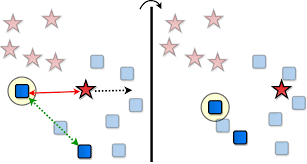
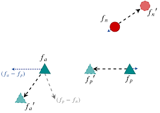

# Moving in the Right Direction: A Regularization for Deep Metric Learning

This readme file is an outcome of the [CENG501 (Spring 2021)](http://kovan.ceng.metu.edu.tr/~sinan/DL/) project for reproducing a paper without an implementation. See [CENG501 (Spring 2021) Project List](https://github.com/sinankalkan/CENG501-Spring2021) for a complete list of all paper reproduction projects.

#  1 Introduction

Moving in the Right Direction: A Regularization for Deep Metric Learning is a CVPR 2020 paper. Main purpose of the paper is 

optimizing loss functions in order to achieve better loss functions. This is achieved by direction regularization to account for the layout of the sampled pairs.

My goal starting this project was to achieve mentioned scores in the paper by implementing direction regularization, also help community.

# # 1.1 Paper Summary

This paper examines existing loss functions and their shortcomings, and proposes a new method which is also adaptable to existing loss functions.

Normally deep metric learning methods try creating optimal distance for specific properties and distributions. Mainly, their function is to map same class samples 
together, while keeping other class maximally seperated. 

  

As stated in the paper, such an approach might lead to a case where a negative sample is pushed to positive samples, thus getting closer to the opposing cluster.

This paper achieves better optimization, and supply better results that can be acquired by triplet loss, proxy loss, msLoss, etc. 

# 2 Method and My Interpretation

As stated in eq4 of the paper,  in a simple scenario with an anchor, a positive and a negative sample, anchor pushes negative sample while positive sample is pulled towards the anchor.
Additionally, negative sample then should move orthogonally to the center of anchor and positive sample. Thus, writers arrive at an orthogonality equation, and aim to minimize that. 

  

Later, it is claimed in the paper that deriving equation can be used in triplet loss, etc. to achieve regularization with a regularization parameter.

# 3 Experiments

# # 3.1 Datasets

Following datasets are used in the experiment section:

    CUB200-2011 (http://www.vision.caltech.edu/visipedia/CUB-200.html)
    CARS196 (https://ai.stanford.edu/~jkrause/cars/car_dataset.html)
    In-Shop Clothes (http://mmlab.ie.cuhk.edu.hk/projects/DeepFashion/InShopRetrieval.html)

For all datasets, images cropped to 224 x 224, with standard preprocessing techniques. Also, data augmentation with random crop, and random horizontal flipping is used. 

# # 3.2 Network

For all experiments googleNet is used with batch normalization, pretrained on ILSVRC 2012-CLS. Adam optimizer is also used. Occasionally embedding dimension of 64 is prefered instead of 512.

# # 3.3 My Result

Unfortunately, I have not been succesful at my attempts run any code, even with high learning rate, unstabilities caused division by 0 type of error which resulted with all data becoming NaN.

# 4 Conclusion

# 5 References 

C. Szegedy et al., "Going deeper with convolutions," 2015 IEEE Conference on Computer Vision and Pattern Recognition (CVPR), 2015, pp. 1-9, doi: 10.1109/CVPR.2015.7298594.

