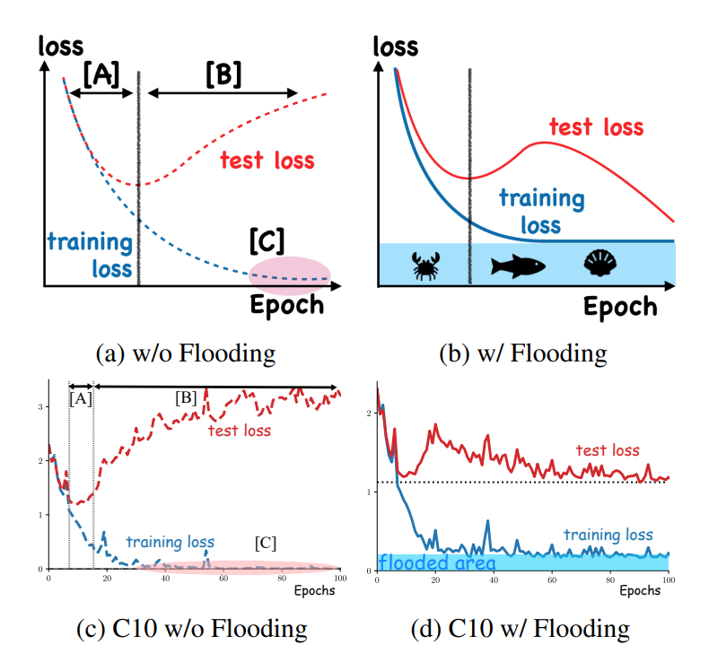
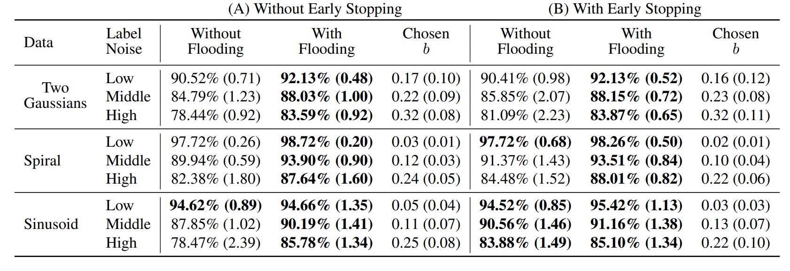
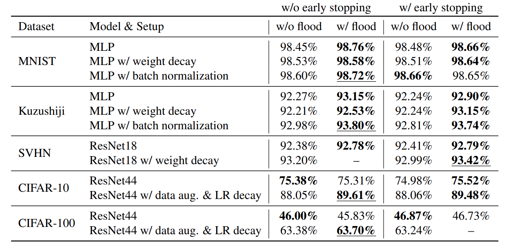
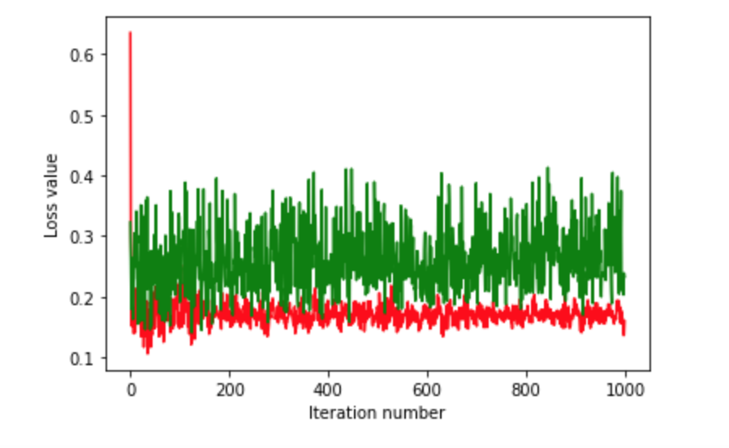
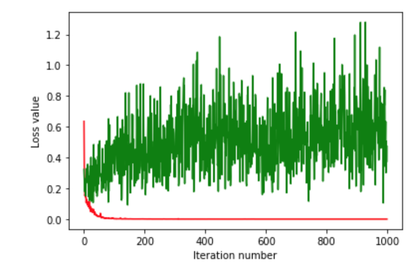
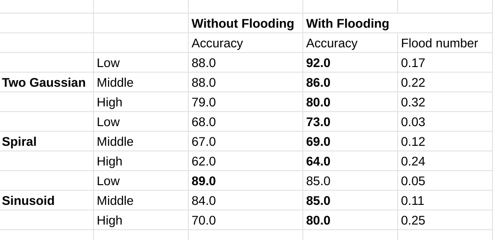

# Do We Need Zero Training Loss After Achieving Zero Training Error?

This readme file is an outcome of the [CENG501 (Spring 2021)](http://kovan.ceng.metu.edu.tr/~sinan/DL/) project for reproducing a paper without an implementation. See [CENG501 (Spring 2021) Project List](https://github.com/sinankalkan/CENG501-Spring2021) for a complete list of all paper reproduction projects.

# 1. Introduction 

Zero training error is considered as important point to get general solution. Mostly, our neural networks is trained until it approaches to the zero loss point. This paper has an assumption that we do not need to wait unti zero loss. In fact learning until zero loss might be harmful. What we can do for obtainnig zero training error without obtaining zero loss is solved by a simple implementation. By one additional hyper-parameter which is flooding parameter, we can avoid approaching zero loss point while our training error is decreasing. 

Flooding parameter can effect the loss curve with the buoyancy. When the loss decreased below the flood level, backward operation starts to make gradient ascent to reach the flood level. This situation is considered as buoyancy effect. When the loss is above the flood level bacpropagation operation makes regular gradient descent method which is considered as gravity effect.  

## 1.1. Paper summary

As the figure below ( it is taken from the original paper) , we can see the flooding point regularization benefits. Without the flooding regularization generalization gap increases in the B region. By using the flooding regularization we can decrease the generalization gap by only using one hyper-parameter which is flooding point coefficient.  



# 2. The method and my interpretation

## 2.1. The original method

### 2.1.1 Datasets 

We have two types of datasets which are sythetic and pytorch ready datasets, on the training part of the code you should indicate your dataset as given below, 

* Choose your input size and output size for "input_dim" and "output_dim" parameters. 

	* Sinusoidal dataset ::> input dim : 2 output dim : 1 class name : Sinusoidal_data
	* Two Gaussian dataset ::> input dim : 10 output dim : 1 class name : Gaussian_data
	* Spiral dataset ::> input dim : 2 output dim : 1 class name : Spiral_data
	* MNIST dataset ::> input dim : 28*28 output dim : 10 class name : MNIST_data
	* CIFAR10 dataset ::> input dim : 3072 output dim : 10 class name : Cifar10_data
	* CIFAR100 dataset ::> input dim : 3072 output dim : 100 class name : Cifar100_data
	* SVHN dataset ::> input dim : 32*32*3 output dim : 10 class name : SVHN_data
	* Kuzushiji dataset ::> input dim : 28*28 output dim : 10 class name : Kuzushiji_data
	
* Choose your nural network structure according to your needs. (Multi layer perceptron network is designed as similar with the neural network which is indicated in the paper) 

```ruby
model = Resnet_18(input_dim, class_number).ResNet18
model = MLP_Net(input_dim, class_number)
```

### 2.1.2 Implementation

Implementation of the method is simple. You can implement this metdhod easily for any training algorithm in pytorch as described below with the code block. By modifiying the loss parameter and backpropagating the modified loss parameter will make a flooding level effect on your loss curve. 


```ruby

outputs = model(inputs)
loss = criterion(outputs, labels)
flood = (loss-b).abs()+b # This is it!
optimizer.zero_grad()
flood.backward()
optimizer.step()

```

## 2.2. My interpretation 

Some neural network parameters were not defined properly , for the synthetis datasets training part we do not know whether the multilayer perceptron has an output activation function to make binary classification such as sigmoid function. I didn't use activation function for the output but I used binary cross entropy loss with logistic loss which gave me better results. I have applied batch normalization for each layer to obtain more robust solutions. 

For the classification part I have used resnet18 and my MLP network that I have used for the synthetic dataset. For the resnet44 I couldn't be sure about which model is taken from where. 

Finally, regularization part was easy and pseudo code which is given in the paper and in the section 2 was so clear to implement the flooding level. 


# 3. Experiments and results

## 3.1. Experimental setup

The original paper uses some sythetic datasets and ready vision datasets to indicate that flooding level regularization can be implemented to any neural network problem. Paper pseudo code is similar to the pytorch training functions , hence I have implemented the code in pytorch. 


## 3.2. Running the code

you can use the ceng501_project.ipynb file in google colab easily which makes it more simple to validate the results. Datasets are in the python class form and their names their input sizes and theit output sizes are indicated in the part 2.1.1 . You need to modify training part of the ipynb file to test which datasets that you want. Also you need to comment/uncomment the naural network type to test your model in the same part of the code. ipynb file has some plotting and accuracy calculation block also to validate your results. It has two training block one also stores test data result in each epoch to see flooding effect on test loss. 

## 3.3 Results 

You can see the results from the paper below, 


The sythetic datasets are tested and the results are given below,(it is taken from the original paper)



Test results with pytorch's ready results are giveen below, ( it is taken from the original paper)  




You can see  an example result from my code, when we compare two results we can easily say that flood prevents training from overfitting problem. Red label indicates training loss, green label indicates the test loss. With flooding efeect we can train neural networks for more general solutions. 

* Gaussian data with flooding (flood_param = 0.17, noise = low ) 


* Gaussian data withot flooding (flood_param = 0.17, noise = low ) 


My resul table for sythetic dataset is given below, 



# Conclusion 

In conclusion, Flooding is a succesful regularization method for the community. Weight decay , l2 regularization assumes that optimal model params are close to zero so that they penalizaes the weights, however it is not always true. Early stopping assumes that overfitting occurs later epochs but this method has one assumption which is learning until zero loss is harmful. The paper provides us reasonable and necessary results by comparing the baseline regularization methods such that we can see that flooding regularization might perform better than l2 regularization , early stopping and weight decay in some cases. 

# 5. References 


Ishida, T., Yamane, I., Sakai, T., Niu, G. &amp; Sugiyama, M.. (2020). Do We Need Zero Training Loss After Achieving Zero Training Error?. <i>Proceedings of the 37th International Conference on Machine Learning</i>, in <i>Proceedings of Machine Learning Research</i> 119:4604-4614 Available from http://proceedings.mlr.press/v119/ishida20a.html.

# Contact 

Mustafa KILINÇ - mustafa.kilinc@ieee.metu.edu.tr


