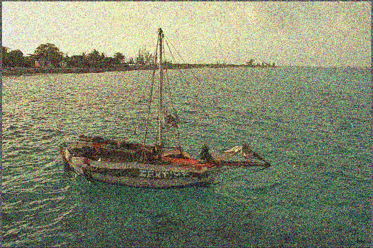

# Noisier2Noise: Learning to Denoise from Unpaired Noisy Data

This readme file is an outcome of the [CENG501 (Spring 2021)](http://kovan.ceng.metu.edu.tr/~sinan/DL/) project for reproducing a paper without an implementation. See [CENG501 (Spring 2021) Project List](https://github.com/sinankalkan/CENG501-Spring2021) for a complete list of all paper reproduction projects.

# 1. Introduction

This is an unofficial implementation of [Noisier2Noise by Moran et al. 2020](https://arxiv.org/abs/1910.11908).

## 1.1. Paper summary

In some fields, for example in astrophotography, radiology (MRI) and computer graphics (Monte Carlo renderings), it is difficult to obtain clean images whereas obtaining a noisy one is much easier. Image denoising is the process where we remove noise from such images. After the rise of deep learning techniques in 2012, people began to use CNNs for this purpose and proposed various methods (see [Tian et al. 2020](https://arxiv.org/abs/1912.13171)). 

In CVPR 2020, Moran et al. proposed Noisier2Noise, which is mainly based on a previous method called [Noise2Noise (Lehtinen et al. 2018)](https://arxiv.org/abs/1803.04189). The main contribution of Noisier2Noise is that it does not require clean image targets to train the network, whereas most deep learning based image denoising techniques (including Noise2Noise) do need them at training stage.

# 2. The method and my interpretation

## 2.1. The original method

<p align="center">
  
  <i>Figure 1. The brief overview of the method. Taken from the original paper[1].</i>
</p>

In summary, the training step works as follows:
* We first apply some noise to the clean image. Note that our network will not see the clean image directly.
* Then, we apply noise one more time to get doubly-noisy realization of the clean image.
* Then, we feed the network with doubly-noisy realization and try to predict singly-noisy realization.

During inference, we give the doubly-noisy realization to our network and expect it to output a singly-noisy one. Then, we compute the residual by subtracting singly-noisy realization from doubly-noisy one. In the last step, we subtract the residual from singly-noisy realization and obtain an estimate of the clean target image.

The network architecture used in this method is [U-Net by Ronneberger et al. (2015)](https://arxiv.org/abs/1505.04597). For more detailed and theoretical information, please check Section 3.2 of the original paper.

## 2.2. My interpretation 

After reading the original paper and Noise2Noise by Lehtinen et al., I was able to implement the method without having any major issues. There are still two ambiguous points, though. 

First, the number of epochs used in their experiments is not mentioned in the original work. The other (and kind of related) problem is, I could not directly understand when to use scheduler to reduce learning rate from 10<sup>-3</sup> to 10<sup>-4</sup>. As a result, I skipped learning rate scheduling and did not implement it.

Other than that, non-additive noise (i.e. Bernoulli noise) implementation is also missing in this project.

# 3. Experiments and results

## 3.1. Experimental setup

**Dependencies**

* Python (3.7.0)
* Numpy (1.19.5)
* PIL (8.3.1)
* PyTorch (1.9.0+cu111) + torchvision (0.10.0+cu111)
* scikit-image (0.18.2)

_(Versions written in parentheses stand for the ones used during the development and testing of this repository)_

I've tried to keep configurations the same as much as possible. However, there are two significant differences, which probably affect the results considerably. 
* In the original paper, authors have used a batch size of 32. But in this work, it is reduced to 16 due to hardware limitations. 
* The original work uses ImageNet dataset in the training phase, which contains over 14 million images, whereas the dataset I've used (i.e. COCO, 2017) contains 118287 images.

## 3.2. Running the code

File structure of the project is as follows:

```
checkpoints
│   │   (*.pt)
code
│   │   main.py
data
└─── <dataset_id>
  └─── test
  │   │   image files (*.jpg, *.png etc.)
  └─── train
  │   │   image files (*.jpg, *.png etc.)
denoised
│   │   image files (*.jpg, *.png etc.)
```

**checkpoints**: This folder contains checkpoints (i.e. metadata of your model) that allow you to resume training your network or to use it for testing purposes. The id of checkpoints show the number of epochs. For example, _checkpoint_00010.pt_ contains metadata of a model trained for 11 epochs.

**code**: This folder contains the code and you are supposed to run the project here.

**data**: This folder contains images. You should keep the file structure as shown above. Simply download the dataset, create a folder for it under this directory, create two separate folders (i.e. test and train) and place images under these directories.

**denoised:** This folder contains denoised images (i.e. the output).

**How to Run**

You should copy training/testing images under data directory according to the file structure shown above <sup>[See here for download links](data/README.md)</sup>. After doing that, simply cd into "code" directory and run 
```
python main.py [test|train] [dataset_id] [save_prob]
```
Default values for these arguments are 'test', 'coco' and '0.0011', respectively. save_prob is used during testing only. For example, if you set it to 0.5, half of the results obtained will be saved under 'denoised' directory. 

Note that if there are no checkpoints, you will not be able to run test mode. And if there are checkpoints, you should remove them or copy them elsewhere to train a network from scratch. See get_run_config() method to change network hyperparameters.

## 3.3. Results

* The code is tested on a Windows 10 (v19042.1110) machine with single NVIDIA GeForce RTX 3070 GPU. 
* The network is trained for 11 epochs, which took ~11 hours in total (i.e. 1h/epoch). 
* The dataset I've used for training is COCO 2017. For testing, both COCO 2017 and Kodak datasets are used.

<p align="center">
    
  
<i>Figure 2. Steps of the method. From left to right: Clean target, Singly-noisy realization, Doubly-noisy realization, Residual, Denoised result</i>
</p>

The full process and outputs of each step are illustrated in Figure 2. Average PSNR and SSIM values are shown in Table 1. Note that to obtain values for "-SN" variation (in which we feed the network with singly-noisy realizations and try to obtain clean image, without reconstruction steps), Kodak dataset is used. For the other one, COCO 2017 is used.

                                                        
|    Network           |    PSNR   |   SSIM   |
| -------------------- | --------- | -------- |
| Ours, α=1, σ=0.25    | 23.856216 | 0.697551 |
| Ours-SN, α=1, σ=0.25 | 18.769699 | 0.383787 |

_**Table 1.** Average PSNR and SSIM values for the trained network. σ stands for the standard deviation of Gaussian noise applied during training phase and α stands for the ratio between σs during training and testing phases. See Section 3.3, Equation 6 in Noisier2Noise paper for details_


<p align="center">
<b>Gallery</b>
</p>

<p align="center">
<i>(Left: Clean target images, Right: Denoised images)</i>
</p>

<p align="center">
   
</p>

<p align="center">
   
</p>

<p align="center">
   
</p>

<p align="center">
   
</p>

<p align="center">
   
</p>

<p align="center">
   
</p>

<p align="center">
  <b>Sample SN Variation Output</b>
</p>  
<p align="center">
<i>(Left: Singly-noisy realization (as network input), Right: Denoised images)</i>
</p>
<p align="center">
   
</p>


# 4. Conclusion

Our results look consistent with the original work. However, I cannot assert that it is 100% accurate due to a silly mistake I've made but I've realized that too late :) 

The authors of the original work present results for 3 separate networks, which are trained with different standard deviation values (0.05, 0.1 and 0.2. See Table 1 in the original work). However, I've trained my network with σ=0.25, which means the amplitude of the noise applied in my experiments are stronger. Therefore, obtaining lower PSNR and SSIM are actually expected. And, comparing their PSNR values (i.e. 27.92 and 27.17, see Table 1 of the original paper, row 2 and 3 for σ=0.2), we can say that the non-SN version of the network performs as expected, quantitatively.

When we examine the outputs qualitatively, we observe that the network is able to remove noise but our results look a bit blurry. Besides, in some cases, they look quite artistic and visually pleasing :)

There may be several reasons for the degradation of the performance our network:
* The dataset we've used is much smaller (~14M vs ~120K). Using a larger dataset may help.
* We've decreased the batch size from 32 to 16, which may also affect our performance.
* We've applied more noise to images during both testing and training phases. If we decrease that, we may get rid of bluriness in our outputs.
* We've stopped training when training loss started to become steady but that may be misleading and 11 epochs may not be enough. Introducing a validation set may help us here.

# 5. References

[1] N. Moran, D. Schmidt, Y. Zhong and P. Coady, "Noisier2Noise: Learning to Denoise from Unpaired Noisy Data", CVPR, 2020.

[2] J. Lehtinen, J. Munkberg, J. Hasselgren, S. Laine, T. Karras, M. Aittala and T. Aila, "Noise2Noise: Learning Image Restoration without Clean Data", 2018.

[3] T. Lin, M. Maire, S. Belongie, L. Bourdev, R. Girshick, J. Hays, P. Perona, D. Ramanan, C. L. Zitnick and P. Dollár, "Microsoft COCO: Common Objects in Context", 2015.

[4] J. Deng, W. Dong, R. Socher, L.-J. Li, K. Li and L. Fei-Fei, "ImageNet: A Large-Scale Hierarchical Image Database". IEEE Computer Vision and Pattern Recognition (CVPR), 2009.

[5] D. Martin, C. Fowlkes, D. Tal and J. Malik, "A Database of Human Segmented Natural Images and its Application to Evaluating Segmentation Algorithms and Measuring Ecological Statistics, Proc. 8th Int'l Conf. Computer Vision, 2001.

[6] C. Tian, L. Fei, W Zheng, Y. Xu, W. Zuo and C. Lin, "Deep Learning on Image Denoising: An overview", 2020

[7] O. Ronneberger, P. Fischer and T. Brox, "U-Net: Convolutional Networks for Biomedical Image Segmentation", 2015.


# Contact

_Please feel free to contact me by email, if you need any further information or have any questions (furkankdem [at] gmail.com)_
